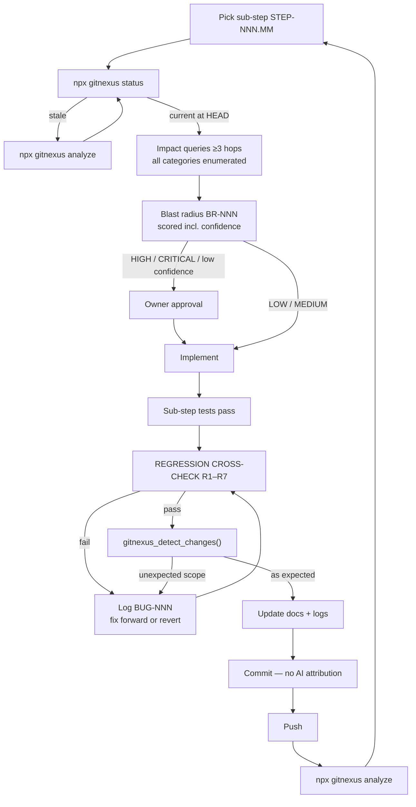

<!-- gitnexus:start -->
# GitNexus — Code Intelligence

This project is indexed by GitNexus as **journeylab** (2625 symbols, 3541 relationships, 0 execution flows). Use the GitNexus MCP tools to understand code, assess impact, and navigate safely.

> If any GitNexus tool warns the index is stale, run `npx gitnexus analyze` in terminal first.

## Always Do

- **MUST run impact analysis before editing any symbol.** Before modifying a function, class, or method, run `gitnexus_impact({target: "symbolName", direction: "upstream"})` and report the blast radius (direct callers, affected processes, risk level) to the user.
- **MUST run `gitnexus_detect_changes()` before committing** to verify your changes only affect expected symbols and execution flows.
- **MUST warn the user** if impact analysis returns HIGH or CRITICAL risk before proceeding with edits.
- When exploring unfamiliar code, use `gitnexus_query({query: "concept"})` to find execution flows instead of grepping. It returns process-grouped results ranked by relevance.
- When you need full context on a specific symbol — callers, callees, which execution flows it participates in — use `gitnexus_context({name: "symbolName"})`.

## Never Do

- NEVER edit a function, class, or method without first running `gitnexus_impact` on it.
- NEVER ignore HIGH or CRITICAL risk warnings from impact analysis.
- NEVER rename symbols with find-and-replace — use `gitnexus_rename` which understands the call graph.
- NEVER commit changes without running `gitnexus_detect_changes()` to check affected scope.

## Resources

| Resource | Use for |
|----------|---------|
| `gitnexus://repo/journeylab/context` | Codebase overview, check index freshness |
| `gitnexus://repo/journeylab/clusters` | All functional areas |
| `gitnexus://repo/journeylab/processes` | All execution flows |
| `gitnexus://repo/journeylab/process/{name}` | Step-by-step execution trace |

## CLI

| Task | Read this skill file |
|------|---------------------|
| Understand architecture / "How does X work?" | `.claude/skills/gitnexus/gitnexus-exploring/SKILL.md` |
| Blast radius / "What breaks if I change X?" | `.claude/skills/gitnexus/gitnexus-impact-analysis/SKILL.md` |
| Trace bugs / "Why is X failing?" | `.claude/skills/gitnexus/gitnexus-debugging/SKILL.md` |
| Rename / extract / split / refactor | `.claude/skills/gitnexus/gitnexus-refactoring/SKILL.md` |
| Tools, resources, schema reference | `.claude/skills/gitnexus/gitnexus-guide/SKILL.md` |
| Index, status, clean, wiki CLI commands | `.claude/skills/gitnexus/gitnexus-cli/SKILL.md` |

<!-- gitnexus:end -->

---

> ⚠️ **Everything above this line is generated by `npx gitnexus analyze` and will be overwritten on every re-index.** Everything below is hand-maintained repository law. Do not move repository rules above the `gitnexus:end` marker — they will be destroyed.

---

# JourneyLab — Working Agreement

This file is the condensed operating contract for anyone changing this repository, human or agent. It is the entry point; the full documentation system lives in [`docs/product/`](docs/product/00-START-HERE.md).

| Field | Value |
| --- | --- |
| Product | **JourneyLab** — a trip digital twin for comparing feasible futures before and during travel |
| Target release | Phase 1 MVP — one region, 3–7 day trips, deep-link handoff |
| Repository | `https://github.com/deepeshgupta12/journeylab.git` |
| Implementation status | **0%** — documentation only; no application code exists |
| Documentation | **147 files** across 10 groups — [start here](docs/product/00-START-HERE.md) |
| Last reviewed | 2026-08-05 |

---

## 1. Non-negotiable rules

1. **No change without a pre-change impact record.** Code, schema, API, event, model, prompt, infrastructure or configuration — all of it. (`REQ-KG-008`, [protocol](docs/product/05-knowledge-graph/CHANGE_IMPACT_PROTOCOL.md))
2. **Work one sub-step at a time.** Each ends in a regression cross-check, documentation update, commit and push. ([protocol](docs/product/02-delivery/SUB_STEP_PROTOCOL.md))
3. **Run the regression cross-check (R1–R7) before every commit.** Previous implementations and fixes must not break.
4. **Commit messages and PR descriptions contain no AI co-authorship attribution.** No `Co-Authored-By: Claude`, no "generated with" line. (`ADR-006`)
5. **Never claim a query, test or verification that did not happen.** `BLOCKED` is an acceptable answer; a fabricated one is not.
6. **Never disable or skip a failing test to go green.** Log it as a bug and escalate.
7. **Never rename with find-and-replace.** Use `gitnexus_rename`.
8. **Deterministic engines own feasibility; the model owns language.** Model output can never mutate trip state without validation and user authorization. (`ADR-002`, `REQ-AI-001`)
9. **Log everything** — implementation, bugs, fixes, enhancements, regression results — in [`docs/product/10-logs/`](docs/product/10-logs/), in the same commit as the work.
10. **`MASTER_TRACKER` is the only source of delivery status.** Never maintain competing status elsewhere.

---

## 2. The change workflow



**Reading the diagram.** Two gates bracket every piece of work. The pre-change gate stops you building on a wrong model of the system. The regression gate stops your work breaking what already exists. The loop closes with a re-index so the next sub-step starts from an accurate graph.

### The regression cross-check (R1–R7)

Run **after** your sub-step's tests pass and **before** committing:

| # | Check | Pass condition |
| --- | --- | --- |
| R1 | Full regression suite — this step's completed sub-steps **and** all `VERIFIED` steps | All green; no unexplained skips |
| R2 | Contract compatibility vs. last release | No unintended breaking diff |
| R3 | `detect_changes()` graph diff | Only expected symbols and flows changed |
| R4 | Untested-requirement count | **Not increased** (ratchet) |
| R5 | Orphan / unowned node count | **Not increased** (ratchet) |
| R6 | Every closed bug's regression test | All passing |
| R7 | Cross-tenant isolation | Pass — **non-negotiable** |

A failure means the sub-step is not done. Fix forward or revert; never proceed red.

---

## 3. GitNexus operation

### Commands

| Task | Command |
| --- | --- |
| Build or refresh the index | `npx gitnexus analyze` |
| Force a full re-index | `npx gitnexus analyze --force` |
| Check freshness | `npx gitnexus status` |
| List indexed repositories | `npx gitnexus list` |
| Delete the index | `npx gitnexus clean [--force] [--all]` |
| Generate wiki documentation | `npx gitnexus wiki` |

> **Use `npx gitnexus`, not `node .gitnexus/run.cjs`.** The project-local runner was not generated in this repository (`ASM-009`) — invoking it fails with `MODULE_NOT_FOUND`.

> **Embeddings stay disabled** (`--embeddings` off) until a documented scan proves no secret or customer payload can enter them (`REQ-KG-007`).

### Verified state (2026-08-05)

| Fact | Value |
| --- | --- |
| Indexed | **~1,860 nodes, ~2,535 edges**, 0 clusters, 0 execution flows |
| Freshness | `status` reports up to date at the indexed commit |
| **Coverage** | **Markdown documentation only — no application source exists** |
| Impact analysis on app code | **`BLOCKED`** — static fallback applies (`RISK-014`) |

**What this means in practice:** until the first source-code merge, `gitnexus_impact` cannot answer questions about application behavior. Use the [static fallback](docs/product/05-knowledge-graph/CHANGE_IMPACT_PROTOCOL.md#6-static-fallback--when-the-graph-cannot-answer) and state plainly in every record:

> Knowledge-graph pre-change check: `BLOCKED`. Static fallback applied. Dependency coverage is unverified; confidence is low. This does not satisfy the `REQ-KG-008` release gate.

**First action after the first code merge:** run `npx gitnexus analyze`, then evaluate `REQ-KG-001` (≥95% files parsed) and `REQ-KG-002` (≥90% symbols owned) for the first time.

### Key queries

| Need | Tool |
| --- | --- |
| What depends on this symbol | `gitnexus_impact({target, direction: "upstream"\|"downstream"})` |
| Full symbol context | `gitnexus_context({name})` |
| Find execution flows by concept | `gitnexus_query({query})` |
| Pre-commit scope check | `gitnexus_detect_changes()` |
| Safe rename | `gitnexus_rename(...)` |
| Security/privacy data flow | `gitnexus_trace(...)`, `gitnexus_pdg_query(...)` |
| API surface impact | `gitnexus_api_impact(...)` |
| Import cycles (module boundary erosion) | `gitnexus_check({cycles: true})` |
| Arbitrary graph query | `gitnexus_cypher(...)` |

Full playbook: [GRAPH_QUERY_PLAYBOOK](docs/product/05-knowledge-graph/GRAPH_QUERY_PLAYBOOK.md).

### Two graphs, permission-separated

| | Domain graph | Code graph |
| --- | --- | --- |
| Explains | Product decisions, evidence, dependencies | Implementation, lineage, runtime impact |
| Scoped by | **Tenant** | **Repository permissions** |
| Personal data | Yes (tenant-scoped) | **None by construction** |
| Built by | `STEP-026` (`services/knowledge/`) | GitNexus |
| Immutable release snapshot | **No** — would conflict with deletion | **Yes** |

Code-graph access grants **no** domain-graph access, and vice versa.

---

## 4. Commit conventions

```
STEP-NNN.MM: <imperative summary under 72 chars>

- Implements: REQ-…, REQ-…
- Blast radius: BR-NNN (LOW|MEDIUM|HIGH|CRITICAL)
- Regression: R1-R7 pass
- Tests: TST-…
- Closes: BUG-NNN (if applicable)
```

- **No AI co-authorship attribution** in any commit or PR description (`ADR-006`).
- One sub-step per logical commit; every commit references a sub-step and a requirement.
- `main` is protected: no direct pushes, required reviews, required checks.
- Branches: `step/NNN-<slug>`, `fix/BUG-NNN-<slug>`, `chore/<slug>`.

Full detail: [WAYS_OF_WORKING](docs/product/02-delivery/WAYS_OF_WORKING.md).

---

## 5. Logging — every change is recorded

Update in the **same commit** as the work:

| Log | Records |
| --- | --- |
| [IMPLEMENTATION_LOG](docs/product/10-logs/IMPLEMENTATION_LOG.md) | What was built, why, decisions taken, what surprised us |
| [BUG_REGISTER](docs/product/10-logs/BUG_REGISTER.md) | Every bug — symptom, root cause, fix, **why tests missed it**, regression test |
| [ENHANCEMENT_LOG](docs/product/10-logs/ENHANCEMENT_LOG.md) | Improvements beyond the requirement — logged before implementing |
| [REGRESSION_LOG](docs/product/10-logs/REGRESSION_LOG.md) | R1–R7 results per sub-step |
| [`10-logs/blast-radius/`](docs/product/10-logs/blast-radius/) | One `BR-NNN` per change |

**Every fixed bug gets a regression test.** Check R6 verifies they all still pass, forever.

---

## 6. Product rules that constrain implementation

These are product promises, not preferences. Breaking one is a defect regardless of what a ticket says.

| Rule | Requirement |
| --- | --- |
| **Zero hard-constraint violations** in delivered scenarios — an S1 if breached | `REQ-CONS-004` |
| Infeasibility returns a **minimal conflict set**, never a plausible invalid plan | `REQ-CONS-005` |
| Scenario runs are **reproducible** from inputs, config, model versions and seed | `REQ-CONS-006` |
| Every volatile fact shows source, observed time, effective time, confidence | `REQ-EVID-001` |
| **An estimate is never rendered as confirmed** | `REQ-EVID-003` |
| Conflicting evidence stays visible — never averaged | `REQ-EVID-002` |
| Low evidence ⇒ **abstain**, never backfill from model memory | `REQ-AI-004` |
| **No core action requires the map**; every visualization has a table + CSV | `REQ-A11Y-002/003` |
| WCAG 2.2 AA, keyboard and screen-reader complete | `REQ-A11Y-001` |
| **No sensitive attribute inferred** from behavior — declaration only | `REQ-PRIV-003` |
| Deletion traverses primary, object, vector, graph, cache, export and token stores | `REQ-PRIV-006` |
| Tenant ID on every row, event and cache key; no cross-tenant access by any path | `REQ-SEC-001/002` |
| Retrieved content and tool descriptions are **untrusted data**, never instructions | `REQ-SEC-006` |
| Every AI capability has a working **non-AI fallback** | `REQ-AI-007` |
| No visa, health, legal or safety guarantees in any output | `REQ-AI-010` |

---

## 7. Current blockers

| ID | Blocker | Effect |
| --- | --- | --- |
| ~~BLK-001~~ | **CLOSED** — Deepesh Kumar Gupta owns all roles (`ADR-010`) | **New gap:** four-eyes approval unsatisfiable with one owner |
| **BLK-002** | No application code exists | Contracts `PROPOSED`; graph gates not evaluable |
| `DEC-002` | Destination region undecided | Blocks `STEP-005`/`STEP-010` — critical path |
| `DEC-004` | Identity provider undecided | Blocks `STEP-002` → 12-step fan-in |
| `DEC-007` | Cloud provider / region / residency | Blocks `STEP-027` |
| `RISK-001` | Provider licence viability unproven (exposure 20) | Highest delivery risk |
| `RISK-014` | Graph covers documentation only | Pre-change checks `BLOCKED` for code |

---

## 8. Where to go next

| I want to… | Go to |
| --- | --- |
| Understand the product | [PRODUCT_CHARTER](docs/product/01-product/PRODUCT_CHARTER.md) |
| See all 28 steps | [PRODUCT_SCOPE](docs/product/01-product/PRODUCT_SCOPE.md) |
| Check delivery status | [MASTER_TRACKER](docs/product/02-delivery/MASTER_TRACKER.md) |
| Start implementing | [SUB_STEP_PROTOCOL](docs/product/02-delivery/SUB_STEP_PROTOCOL.md) → [STEP-001](docs/product/08-steps/STEP-001-foundation-and-repository-governance.md) |
| Make any change safely | [CHANGE_IMPACT_PROTOCOL](docs/product/05-knowledge-graph/CHANGE_IMPACT_PROTOCOL.md) |
| Find a contract | [API](docs/product/04-contracts/API_CONTRACTS.md) · [Event](docs/product/04-contracts/EVENT_CONTRACTS.md) · [Data](docs/product/04-contracts/DATA_CONTRACTS.md) |
| Know what is gated and why | [OUT_OF_SCOPE](docs/product/01-product/OUT_OF_SCOPE.md) |
| Everything else | [00-START-HERE](docs/product/00-START-HERE.md) |
