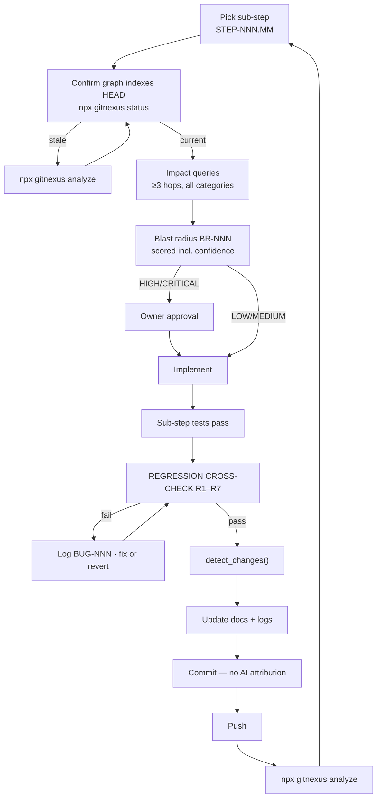

# JourneyLab — Start Here

| Field | Value |
| --- | --- |
| Product | **JourneyLab** — a trip digital twin for comparing feasible futures before and during travel |
| Slug / domain | `journeylab` · Travel (consumer planning + in-trip decision support) |
| Target release | **Phase 1 MVP** — one region, 3–7 day trips, deep-link booking handoff |
| Documentation status | **Complete and internally consistent; describes a product that does not yet exist** |
| Implementation status | **0%** — no application code, contracts, tests or infrastructure |
| Repository | `https://github.com/deepeshgupta12/journeylab.git` |
| Document owner | Deepesh Kumar Gupta (`@deepeshgupta12`) |
| Last reviewed | 2026-08-05 |
| Source blueprint | `01_JourneyLab_Product_and_Technical_Blueprint.pdf` v1.0 · `00_AI_Product_Portfolio_Index.pdf` v1.0 |

---

## 1. What this is

The operational source of truth for JourneyLab's scope, architecture, contracts, implementation sequencing, knowledge graphs, change-impact analysis, testing, release readiness and delivery tracking.

**Read this first, in this order:**

1. [PRODUCT_CHARTER](01-product/PRODUCT_CHARTER.md) — what the product is and its boundaries
2. [PRODUCT_SCOPE](01-product/PRODUCT_SCOPE.md) — the 28 lifecycle steps
3. [MASTER_TRACKER](02-delivery/MASTER_TRACKER.md) — **the only source of delivery status**
4. [CHANGE_IMPACT_PROTOCOL](05-knowledge-graph/CHANGE_IMPACT_PROTOCOL.md) — mandatory before writing any code
5. [SUB_STEP_PROTOCOL](02-delivery/SUB_STEP_PROTOCOL.md) — how work is actually executed and committed

The root [`CLAUDE.md`](../../CLAUDE.md) is the condensed working agreement for anyone — human or agent — making changes.

---

## 2. Document groups

| Group | Contents | Owner |
| --- | --- | --- |
| [01-product/](01-product/) | Charter, problem and evidence, personas, scope, requirements, traceability, metrics, scope boundaries, glossary | Product Lead |
| [02-delivery/](02-delivery/) | Master tracker, roadmap, dependencies, assumptions, risks, decisions, changelog, release plan, sub-step protocol, ways of working | TPM |
| [03-architecture/](03-architecture/) | System context, technical, frontend, backend, data, AI/ML, integration, security, NFRs, observability, deployment | Product Architect |
| [04-contracts/](04-contracts/) | API, event, data contracts, error model, authorization matrix, integration contracts, change policy | Product Architect |
| [05-knowledge-graph/](05-knowledge-graph/) | Domain and code graphs, schema, indexing, query playbook, change-impact protocol, blast-radius template, governance | Platform |
| [06-quality/](06-quality/) | Test strategy, acceptance catalog, AI evaluation, security, performance/resilience, release readiness | QA + Engineering |
| [07-operations/](07-operations/) | Operations, runbooks, incident response, retention/deletion, backup/DR, cost/capacity | SRE |
| [08-steps/](08-steps/) | 28 step files + sub-step files | Step owners |
| [09-templates/](09-templates/) | Step, sub-step, ADR, change-impact, API change, runbook, release checklist templates | TPM |
| [10-logs/](10-logs/) | Implementation, bug, enhancement and regression logs; blast-radius records | Implementing engineers |

---

## 3. How to use these documents, by role

| Role | Start with | Then |
| --- | --- | --- |
| **Product** | [Charter](01-product/PRODUCT_CHARTER.md), [Problem & evidence](01-product/PROBLEM_AND_EVIDENCE.md), [Scope](01-product/PRODUCT_SCOPE.md) | [Success metrics](01-product/SUCCESS_METRICS.md), [Roadmap](02-delivery/ROADMAP.md), [Risks](02-delivery/RISK_REGISTER.md) |
| **Design** | [Personas](01-product/PERSONAS_AND_JOBS.md), [Frontend architecture](03-architecture/FRONTEND_ARCHITECTURE.md) | Step files §11, [Acceptance tests](06-quality/ACCEPTANCE_TEST_CATALOG.md) |
| **Frontend** | [Frontend architecture](03-architecture/FRONTEND_ARCHITECTURE.md) route matrix | [API contracts](04-contracts/API_CONTRACTS.md), [Error model](04-contracts/ERROR_MODEL.md), step files §11 |
| **Backend** | [Backend architecture](03-architecture/BACKEND_ARCHITECTURE.md) service matrix | [API](04-contracts/API_CONTRACTS.md) / [Event](04-contracts/EVENT_CONTRACTS.md) contracts, step files §12 |
| **Data** | [Data architecture](03-architecture/DATA_ARCHITECTURE.md), [Data contracts](04-contracts/DATA_CONTRACTS.md) | [Integration architecture](03-architecture/INTEGRATION_ARCHITECTURE.md), [Retention](07-operations/DATA_RETENTION_AND_DELETION.md) |
| **AI/ML** | [AI architecture](03-architecture/AI_LLM_RAG_ML_ARCHITECTURE.md) | [AI evaluation](06-quality/AI_ML_EVALUATION.md), step files §15 |
| **QA** | [Test strategy](06-quality/TEST_STRATEGY.md), [Acceptance catalog](06-quality/ACCEPTANCE_TEST_CATALOG.md) | [Traceability](01-product/REQUIREMENTS_TRACEABILITY.md), step files §22 |
| **Security / Privacy** | [Security & responsible AI](03-architecture/SECURITY_PRIVACY_RESPONSIBLE_AI.md), [Authorization matrix](04-contracts/AUTHORIZATION_MATRIX.md) | [Security testing](06-quality/SECURITY_TESTING.md), [Retention](07-operations/DATA_RETENTION_AND_DELETION.md) |
| **Operations / SRE** | [Operations](07-operations/OPERATIONS_AND_SUPPORT.md), [Runbooks](07-operations/RUNBOOK_INDEX.md) | [Observability](03-architecture/OBSERVABILITY_ARCHITECTURE.md), [Incident response](07-operations/INCIDENT_RESPONSE.md), [Backup & DR](07-operations/BACKUP_RESTORE_AND_DR.md) |
| **Any implementer** | [CHANGE_IMPACT_PROTOCOL](05-knowledge-graph/CHANGE_IMPACT_PROTOCOL.md) | [SUB_STEP_PROTOCOL](02-delivery/SUB_STEP_PROTOCOL.md), [Ways of working](02-delivery/WAYS_OF_WORKING.md) |

---

## 4. The mandatory knowledge-graph-first change workflow

> **No code, schema, API, event, model, prompt, infrastructure or configuration change may begin until the pre-change impact analysis is complete and recorded** (`REQ-KG-008`).

**Reading the diagram.** Two gates bracket every piece of work. The pre-change gate stops you building on a wrong model of the system; the regression gate (R1–R7) stops your work from breaking what already exists. The loop closes with a re-index, so the next sub-step starts from an accurate graph.

**Current capability — stated honestly:** GitNexus is installed and indexing this repository (**~1,860 nodes, ~2,535 edges**, verified 2026-08-05), but the index covers **Markdown documentation only** because no application source exists. Impact analysis on application symbols is therefore `BLOCKED`; the [static fallback](05-knowledge-graph/CHANGE_IMPACT_PROTOCOL.md#6-static-fallback--when-the-graph-cannot-answer) applies and **does not satisfy the release gate** (`RISK-014`).

**Commands:** `npx gitnexus analyze` · `npx gitnexus status` · `npx gitnexus list` · `npx gitnexus clean`
The project-local `.gitnexus/run.cjs` runner was **not** generated — use `npx gitnexus` (`ASM-009`).

---

## 5. Documentation rules

1. **[MASTER_TRACKER](02-delivery/MASTER_TRACKER.md) is the only source of delivery status.** No other document maintains competing status.
2. **Only these statuses exist:** `NOT_STARTED` · `DISCOVERY` · `READY` · `IN_PROGRESS` · `BLOCKED` · `IN_REVIEW` · `VERIFIED` · `RELEASED` · `DEFERRED` · `NOT_APPLICABLE`.
3. **Never claim verification that did not happen.** `BLOCKED` and "not evaluable" are acceptable states; a fabricated result is not.
4. **Machine-readable contracts win.** When `contracts/openapi.yaml` exists it is authoritative; Markdown explains and must not duplicate schemas.
5. **Paths are `PROPOSED`** until verified against real code.
6. **Distinguish** confirmed decisions, source-supported facts, assumptions, proposals and gated work — every claim carries its class.
7. **Documentation freshness:** a document is fresh when its `Last reviewed` date is within its review interval and it is consistent with the release commit. A stale document blocks its step's transition to `VERIFIED`.
8. **Commit messages and PR descriptions must not contain AI co-authorship attribution** (`ADR-006`).

---

## 6. Document map

| File | Owner role | Status | Upstream source |
| --- | --- | --- | --- |
| [00-START-HERE](00-START-HERE.md) | Documentation lead | `READY` | This documentation set |
| [PRODUCT_CHARTER](01-product/PRODUCT_CHARTER.md) | Product Lead | `DISCOVERY` | Blueprint §1, §4 |
| [PROBLEM_AND_EVIDENCE](01-product/PROBLEM_AND_EVIDENCE.md) | Product Lead | `DISCOVERY` | Blueprint §2, §3 |
| [PERSONAS_AND_JOBS](01-product/PERSONAS_AND_JOBS.md) | Product Lead | `DISCOVERY` | Blueprint §5 |
| [PRODUCT_SCOPE](01-product/PRODUCT_SCOPE.md) | Product Lead | `DISCOVERY` | Blueprint §6, §19, §21 |
| [FUNCTIONAL_REQUIREMENTS](01-product/FUNCTIONAL_REQUIREMENTS.md) | Product Architect | `DISCOVERY` | Blueprint §7–9, §13–15 |
| [REQUIREMENTS_TRACEABILITY](01-product/REQUIREMENTS_TRACEABILITY.md) | TPM | `DISCOVERY` | Requirements + scope |
| [SUCCESS_METRICS](01-product/SUCCESS_METRICS.md) | Product Lead | `DISCOVERY` | Blueprint §5, §17 |
| [OUT_OF_SCOPE](01-product/OUT_OF_SCOPE.md) | Product Lead | `DISCOVERY` | Blueprint §23, reclassified |
| [GLOSSARY](01-product/GLOSSARY.md) | Product Architect | `READY` | Blueprint App. B |
| [MASTER_TRACKER](02-delivery/MASTER_TRACKER.md) | TPM | `DISCOVERY` | All step files |
| [ROADMAP](02-delivery/ROADMAP.md) | TPM | `DISCOVERY` | Blueprint §21 |
| [DEPENDENCY_REGISTER](02-delivery/DEPENDENCY_REGISTER.md) | TPM | `DISCOVERY` | Scope + integrations |
| [ASSUMPTION_REGISTER](02-delivery/ASSUMPTION_REGISTER.md) | TPM | `DISCOVERY` | Blueprint §1 + analysis |
| [RISK_REGISTER](02-delivery/RISK_REGISTER.md) | TPM | `DISCOVERY` | Blueprint §22 |
| [DECISION_LOG](02-delivery/DECISION_LOG.md) | Product Architect | `DISCOVERY` | This work |
| [CHANGELOG](02-delivery/CHANGELOG.md) | Documentation lead | `READY` | This work |
| [RELEASE_PLAN](02-delivery/RELEASE_PLAN.md) | TPM | `DISCOVERY` | Blueprint §18 |
| [SUB_STEP_PROTOCOL](02-delivery/SUB_STEP_PROTOCOL.md) | TPM + Platform | `READY` | Repository-owner directive |
| [WAYS_OF_WORKING](02-delivery/WAYS_OF_WORKING.md) | TPM | `READY` | This work |
| [03-architecture/](03-architecture/) — 11 files | Product Architect and leads | `DISCOVERY` | Blueprint §8–10, §14–15, §18 |
| [04-contracts/](04-contracts/) — 7 files | Product Architect | `DISCOVERY` (all `PROPOSED`) | Blueprint §11–12 |
| [05-knowledge-graph/](05-knowledge-graph/) — 8 files | Platform | `READY` | Blueprint §20 + verified GitNexus state |
| [06-quality/](06-quality/) — 6 files | QA + Engineering | `DISCOVERY` | Blueprint §16 |
| [07-operations/](07-operations/) — 6 files | SRE | `DISCOVERY` | Blueprint §18 |
| [08-steps/](08-steps/) — 28 steps + 6 sub-steps | Step owners | `DISCOVERY` / `DEFERRED` | Blueprint §6, §19 |
| [09-templates/](09-templates/) — 7 files | TPM | `READY` | This work |
| [10-logs/](10-logs/) — 6 files | Implementing engineers | `READY` (empty — no work yet) | Repository-owner directive |

---

## 7. Unresolved blockers and decisions

| ID | Blocker | Impact |
| --- | --- | --- |
| ~~BLK-001~~ | **CLOSED** — Deepesh Kumar Gupta (`@deepeshgupta12`) owns all roles (`ADR-010`) | Steps may leave `READY`. **New gap:** four-eyes approval unsatisfiable with one owner |
| **BLK-002** | **No application code exists** | Contracts are `PROPOSED`; graph coverage gates are not evaluable; traceability is unverified |
| `DEC-002` | Phase 1 destination region undecided | Blocks `STEP-005`, `STEP-010`, all evaluation corpora — **critical path** |
| `DEC-003` | Business model undecided | Determines whether a billing step exists at all |
| `DEC-004` | Identity provider undecided | Blocks `STEP-002` → 12-step fan-in |
| `DEC-005` | KPI thresholds undefined | Phase 1 exit gates not objectively evaluable |
| `DEC-006` | KPI review cadence and forum | Governance |
| `DEC-007` | Cloud provider, region, residency | Blocks `STEP-027`, DR and compliance analysis |
| `DEC-008` | Routing provider | Accessibility routing claim unvalidated |
| `DEC-009` | Event backbone | Blocks `STEP-006` shape |
| `RISK-001` | Provider licence viability unproven (exposure 20) | Highest delivery risk |
| `RISK-014` | Graph covers documentation only | Pre-change checks `BLOCKED` for code |

---

## 8. Documentation audit

**Counts computed from the generated files on 2026-08-05, not estimated.**

| Metric | Count | Method |
| --- | --- | --- |
| Markdown files in `docs/product/` | **147** | `find docs/product -name '*.md'` |
| Files created this session | **144** | 147 minus 3 pre-existing |
| Files updated this session | **1** | `OUT_OF_SCOPE.md` reclassified per owner direction |
| Files pre-existing and preserved | **3** | charter, problem/evidence, personas |
| Scope steps defined | **28** | `PRODUCT_SCOPE` §4 |
| Step files | **28** | one per step, all 28 sections each |
| Sub-step files | **48** | STEP-001…006 foundation chain (of 228 total; rest created just-ahead-of-need per `ADR-008`) |
| Requirements | **130** | 124 matching `REQ-[A-Z]+-NNN` + 6 `REQ-A11Y-NNN` |
| Acceptance test IDs | **130** | 124 + 6 `TST-A11Y-NNN` |
| API operations | **18** | `API-001`–`API-018` |
| Domain events | **8** | `EVT-001`–`EVT-008` |
| Data entities | **16** | `DATA-001`–`DATA-016` |
| AI capabilities | **10** | `AI-001`–`AI-009` + `AI-010` reserved |
| Risks | **14** | `RISK-001`–`RISK-014` |
| Open assumptions | **18** | of 25 registered; 7 resolved by direct verification |
| Unresolved decisions | **8** | `DEC-002`–`DEC-009` |
| Accepted ADRs | **6** | `ADR-001`–`ADR-006` |
| Knowledge-graph queries | **16** | `KG-Q-001`–`KG-Q-016` |
| **Broken relative links** | **0** | scripted check across all 105 files |
| Requirements with no step | **0** | reverse-trace in `REQUIREMENTS_TRACEABILITY` §7 |
| Requirements with no test | **0** | every `REQ` maps to a `TST` |
| Steps missing from the tracker | **0** | 28/28 rows present |
| Steps with fewer than 28 sections | **0** | template-conformant |
| `NOT_APPLICABLE` files | **0** | every required file has substantive content |

### Verified environment facts

| Fact | Value | How verified |
| --- | --- | --- |
| Application source files | **0** | directory enumeration |
| Contracts, migrations, CI, IaC on disk | **None** | directory enumeration |
| GitNexus installed | **Yes** | `npx gitnexus analyze` succeeded |
| Index size | **~1,860 nodes, ~2,535 edges** | analyzer output |
| Index freshness | Up to date at the indexed commit | `npx gitnexus status` |
| Index coverage | **Markdown documentation only** | no source exists to index |
| Local Node version | v25.9.0 — **application runtime must still be pinned to Node 24 LTS** | `node -v` via runner |

### What this audit does not claim

- No requirement has been verified against an implementation, because there is none.
- No graph coverage gate (`REQ-KG-001`, `REQ-KG-002`) has been evaluated — they have no subject.
- No test has been executed; all `TST-*` IDs are specifications.
- No legal, privacy, accessibility or security review has been performed on this content.
