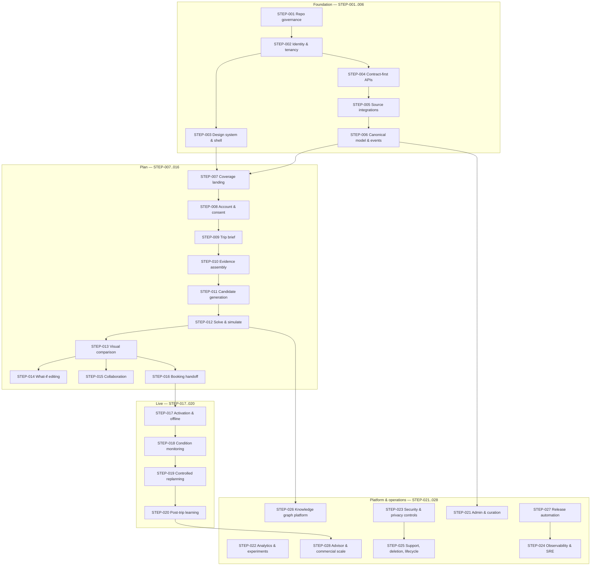

# JourneyLab — Complete Product Scope

| Field | Value |
| --- | --- |
| Owner | Product Lead (unassigned — `BLK-001`) |
| Status | `DISCOVERY` — scope decomposed from blueprint; step ownership unassigned |
| Upstream source | Blueprint §6 (Complete end-to-end product scope), §19 (implementation manifest), §21 (roadmap) |
| Step count | **28** (`STEP-001` … `STEP-028`) |
| Last reviewed | 2026-08-05 |

Navigation: [Charter](PRODUCT_CHARTER.md) · [Requirements](FUNCTIONAL_REQUIREMENTS.md) · [Traceability](REQUIREMENTS_TRACEABILITY.md) · [Master tracker](../02-delivery/MASTER_TRACKER.md) · [Step files](../08-steps/) · [00-START-HERE](../00-START-HERE.md)

---

## 1. How this document relates to the step files

This document is the **scope decomposition**: it defines the step boundary, outcome and release phase for all 28 steps and shows how they connect. Each step's implementation detail (28 mandatory sections including workflow, contracts, blast radius and acceptance evidence) lives in exactly one file in [`08-steps/`](../08-steps/).

**Status is not maintained here.** [MASTER_TRACKER](../02-delivery/MASTER_TRACKER.md) is the single source of delivery status. This document defines *what the step is*; the tracker records *where it stands*.

The blueprint's §6 lifecycle contains 15 user-facing stages. Those became `STEP-007` … `STEP-021` plus `STEP-025`. The blueprint's §19 implementation manifest contains 18 engineering steps, whose foundation, platform and operational work became `STEP-001` … `STEP-006` and `STEP-022` … `STEP-028`. **Foundation and operational work is in scope as numbered steps, not as invisible prerequisites** — this is required by operating rule 6 in the task standard and portfolio standard §7.31.

---

## 2. Scope map

**Reading the diagram.** Foundation steps gate everything: no product surface can ship before tenancy (`STEP-002`) and contracts (`STEP-004`) exist. The planning chain is strictly sequential from brief to comparison because each stage consumes the previous stage's immutable artifact (brief → evidence pack → candidate pool → scenario set). Comparison fans out into three independent decisions (edit, collaborate, book). The live chain requires a selected canonical plan. Platform steps run in parallel but `STEP-027` (release automation) gates `STEP-024`'s drills, and `STEP-023` gates `STEP-025`'s deletion proof.

---

## 3. Release phase boundary

| Phase | Steps | Boundary rule |
| --- | --- | --- |
| **Phase 0 — Discovery** | Prerequisite to all | Blueprint exit gate: 15+ users complete comparison tasks; provider terms viable |
| **Phase 1 — MVP** *(target release)* | `STEP-001` … `STEP-013`, `STEP-016`, `STEP-021`, `STEP-023`, `STEP-024`, `STEP-025`, `STEP-026`, `STEP-027` | Brief → evidence → 3 scenarios → comparison → deep-link handoff, for **one region, 3–7 days**. Deep links only; no live trip changes |
| **Phase 2 — Interactive/collaborative** | `STEP-014`, `STEP-015`, `STEP-022` | What-if edits, group decision, preference learning, second destination pack |
| **Phase 3 — Live companion** | `STEP-017`, `STEP-018`, `STEP-019`, `STEP-020` | Offline pack, impact matching, controlled replan, post-trip learning |
| **Phase 4 — Commercial scale** | `STEP-028` | Advisor white-label, provider portfolio, selective booking APIs after review |

Steps outside Phase 1 are **`DEFERRED`, not omitted** — each has a complete step file so the gate is deliberate and reviewable ([OUT_OF_SCOPE](OUT_OF_SCOPE.md)).

---

## 4. Step definitions

Each entry below is the scope contract. Field detail expands in the linked step file.

### STEP-001 — Foundation and repository governance
- **File:** [STEP-001-foundation-and-repository-governance.md](../08-steps/STEP-001-foundation-and-repository-governance.md) · **Phase:** 1
- **Purpose / outcome:** A reproducible monorepo with ownership, contract boundaries and local dev environment exists before any feature work.
- **Actors:** Staff Engineer, TPM. **Trigger:** Repository creation. **Preconditions:** Repo URL provided (`BLK-002` — pending).
- **Inputs:** Blueprint §19 Step 1 manifest; portfolio standard §5 repo shape.
- **Normal flow:** Scaffold workspace → pin toolchain → define ownership → local compose → ADR-001.
- **Failure flow:** CI rejects unlocked or unowned changes; a new engineer unable to run the documented commands blocks the exit gate.
- **Frontend:** Workspace package skeleton only. **Backend:** Service package skeleton only.
- **APIs/events/data/AI:** None. **Security:** CODEOWNERS, SECURITY.md, branch protection.
- **Telemetry:** CI pass rate, local setup time. **Dependencies:** none.
- **Acceptance:** New engineer runs lint, tests and the empty app from documented commands.
- **Rollback:** Repository scaffold is additive; revert by branch deletion.
- **Requirements:** `REQ-PLAT-001` … `REQ-PLAT-004`.

### STEP-002 — Identity, tenancy and authorization
- **File:** [STEP-002-identity-tenancy-and-authorization.md](../08-steps/STEP-002-identity-tenancy-and-authorization.md) · **Phase:** 1
- **Purpose / outcome:** Isolation and permission primitives every later endpoint and job depends on.
- **Actors:** Security Architect, Backend. **Trigger:** `STEP-001` exit. **Preconditions:** Repo scaffold.
- **Inputs:** OIDC provider choice (`DEC-004`, open), persona permission summary.
- **Normal flow:** Session helpers → tenant-context dependency → policy definitions → provisioning → RLS migration → isolation tests.
- **Failure flow:** Unauthorized and cross-tenant operations must fail deterministically and be audited, never degrade open.
- **Frontend:** Session, token refresh, role-aware rendering. **Backend:** Auth dependency, policy engine, RLS.
- **APIs:** `API-001`+ auth envelope. **Data:** `DATA-001` Organization, `DATA-002` User.
- **Security:** OIDC + passkeys, workload identity, row-level security, `REQ-SEC-001` … `REQ-SEC-004`.
- **Telemetry:** Auth failure rate, cross-tenant denial count. **Dependencies:** `STEP-001`.
- **Acceptance:** Every request and event carries tenant and actor context; isolation tests pass.
- **Rollback:** Feature-flagged provider; RLS policies are expand/contract migrations.

### STEP-003 — Design system and application shell
- **File:** [STEP-003-design-system-and-application-shell.md](../08-steps/STEP-003-design-system-and-application-shell.md) · **Phase:** 1
- **Purpose / outcome:** Accessible, responsive shell and reusable primitives before workflow pages diverge.
- **Actors:** Frontend Lead, Design. **Trigger:** `STEP-002` exit.
- **Inputs:** WCAG 2.2 AA standard, Tailwind 4.3 baseline, token spec.
- **Normal flow:** Tokens → accessible components → app frame → navigation → i18n → automated a11y checks.
- **Failure flow:** Global error boundaries; component-level fallbacks so one failure never blanks the frame.
- **Frontend:** All of it. **Backend:** none.
- **Security:** CSP, no sensitive data in client bundles. **AI:** none.
- **Telemetry:** Accessibility failures, Core Web Vitals. **Dependencies:** `STEP-002`.
- **Acceptance:** Core components pass WCAG 2.2 AA checks; every state has loading, empty, partial, error and retry behavior (`REQ-A11Y-001` … `REQ-A11Y-006`).

### STEP-004 — Contract-first platform APIs
- **File:** [STEP-004-contract-first-platform-apis.md](../08-steps/STEP-004-contract-first-platform-apis.md) · **Phase:** 1
- **Purpose / outcome:** Stable resource, command, event and webhook contracts before implementations proliferate.
- **Actors:** Product Architect, Backend. **Trigger:** `STEP-002` exit.
- **Inputs:** Blueprint §11 contract table; RFC 9457; OpenAPI 3.1; AsyncAPI.
- **Normal flow:** OpenAPI → AsyncAPI → JSON Schema → generated clients → API composition → compatibility tests.
- **Failure flow:** CI rejects accidental breaking changes; generated clients are never hand-edited.
- **APIs:** `API-001` … `API-016` defined here. **Events:** `EVT-001` … `EVT-006`.
- **Dependencies:** `STEP-002`. **Acceptance:** CI generates clients, validates examples, blocks breaking change (`REQ-PLAT-005` … `REQ-PLAT-008`).

### STEP-005 — Source integrations and ingestion
- **File:** [STEP-005-source-integrations-and-ingestion.md](../08-steps/STEP-005-source-integrations-and-ingestion.md) · **Phase:** 1
- **Purpose / outcome:** Acquire product inputs with consent, provenance, replay and reconciliation.
- **Actors:** Data Architect, Backend. **Trigger:** `STEP-004` exit **and** `EV-GAP-002` closed (licence terms).
- **Inputs:** Places, weather, transit, affiliate providers; licence terms.
- **Normal flow:** Adapter per source → entity resolution → freshness policy → sanitized fixtures.
- **Failure flow:** Circuit breakers, quota budgets, backfill checkpoints, reconciliation; bounded cached data only when clearly marked.
- **Data:** `DATA-006` Place, `DATA-007` EvidenceFact. **Security:** SSRF protection, egress allowlist, credential rotation.
- **Dependencies:** `STEP-004`, `RISK-001`. **Acceptance:** Every source has credential handling, rate limits, checkpoint state, schema validation, reconciliation, backfill and deletion behavior (`REQ-DATA-001` … `REQ-DATA-006`).

### STEP-006 — Canonical data model and event backbone
- **File:** [STEP-006-canonical-data-model-and-event-backbone.md](../08-steps/STEP-006-canonical-data-model-and-event-backbone.md) · **Phase:** 1
- **Purpose / outcome:** Normalize inputs into versioned entities and replayable domain events.
- **Actors:** Data Architect, Backend. **Trigger:** `STEP-005` exit.
- **Normal flow:** Domain migration → entities and invariants → repositories → normalizers → transactional outbox → quality expectations.
- **Failure flow:** Outbox replay; dead-letter handling; schema-version mismatch rejected not coerced.
- **Data:** `DATA-001` … `DATA-016`. **Events:** all `EVT-*` delivery.
- **Dependencies:** `STEP-005`. **Acceptance:** Canonical records retain source, observed time, effective time and schema version; events rebuild read models (`REQ-DATA-007` … `REQ-DATA-010`).

### STEP-007 — Discovery landing and destination coverage
- **File:** [STEP-007-discovery-landing-and-destination-coverage.md](../08-steps/STEP-007-discovery-landing-and-destination-coverage.md) · **Phase:** 1
- **Purpose / outcome:** Set expectations before account creation and prevent unsupported trip requests.
- **Actors:** `PER-001` anonymous visitor; marketing/content system. **Trigger:** Landing visit.
- **Inputs:** Origin, broad destination interest, dates, device locale.
- **Normal flow:** Show supported regions, freshness, limitations, sample comparisons, privacy summary → validate dates/geography against coverage → qualified start action.
- **Failure flow:** Insufficient coverage or provider health → **no misleading partial simulation**; explain the gap; preserve inquiry only with consent; offer waitlist or read-only inspiration mode.
- **Frontend:** SSR public/SEO pages. **Backend:** Coverage query, provider health read.
- **APIs:** `API-017` coverage lookup. **Data:** coverage read model.
- **AI:** none (deterministic coverage rules). **Privacy:** consent before storing an inquiry.
- **Acceptance:** A user can tell what is supported, what data is used and what JourneyLab will not do **before signing in** (`REQ-TRIP-001`, `REQ-EVID-006`).

### STEP-008 — Account, consent and traveler profile
- **File:** [STEP-008-account-consent-and-traveler-profile.md](../08-steps/STEP-008-account-consent-and-traveler-profile.md) · **Phase:** 1
- **Purpose / outcome:** Portable preference and constraint profile without forcing unnecessary personal data collection.
- **Actors:** `PER-001`, `PER-002`, identity service.
- **Normal flow:** Account or privacy-preserving guest session → separate hard accessibility needs from soft preferences → skip/edit/export/delete with purpose-specific consent.
- **Failure flow:** Recover interrupted onboarding; **never infer sensitive mobility or health data from unrelated behavior**.
- **Data:** `DATA-003` TravelerProfile (versioned), consent record.
- **Security/privacy:** Accessibility + age are sensitive classes; `REQ-PRIV-001` … `REQ-PRIV-004`.
- **Acceptance:** Planning completes with minimal data; every stored profile attribute is inspectable and removable.

### STEP-009 — Trip brief and structured constraints
- **File:** [STEP-009-trip-brief-and-structured-constraints.md](../08-steps/STEP-009-trip-brief-and-structured-constraints.md) · **Phase:** 1
- **Purpose / outcome:** Convert natural-language intent and form input into an auditable planning specification.
- **Actors:** `PER-001`, `PER-002`, intent service.
- **Normal flow:** Parse text to typed constraint document → classify each item hard/soft/inferred/unresolved → ask **only blocking** clarifications → confirm interpretation.
- **Failure flow:** Ambiguous currency, age, date or mobility statements trigger clarification; impossible constraints identified **before** search.
- **AI:** `AI-001` TripBrief extraction (structured JSON Schema output, deterministic validator owns typing).
- **Data:** `DATA-005` TripBrief (immutable version). **Events:** `EVT-001`.
- **Acceptance:** User can edit the structured brief and understand every inferred field (`REQ-CONS-001`, `REQ-CONS-002`).

### STEP-010 — Destination evidence assembly
- **File:** [STEP-010-destination-evidence-assembly.md](../08-steps/STEP-010-destination-evidence-assembly.md) · **Phase:** 1
- **Purpose / outcome:** Time-aware evidence pack for the requested window.
- **Actors:** Retrieval, destination data and curation services.
- **Normal flow:** Retrieve places, hours, closures, price ranges, transit, weather, crowd signals, accessibility evidence → deduplicate with effective/observed time, source, confidence → flag conflicts, missing critical facts, stale sources.
- **Failure flow:** Provider failure uses bounded cached data **only when clearly marked**; missing critical evidence lowers scenario confidence or blocks affected options.
- **AI:** `AI-002` hybrid temporal RAG; `AI-004` corrective retrieval / abstention.
- **Data:** `DATA-007` EvidenceFact, `DATA-008` EvidencePack (immutable). **Events:** `EVT-002`.
- **Acceptance:** Every fact used by the solver is source-addressable and governed by freshness policy (`REQ-EVID-001` … `REQ-EVID-005`).

### STEP-011 — Candidate generation
- **File:** [STEP-011-candidate-generation.md](../08-steps/STEP-011-candidate-generation.md) · **Phase:** 1
- **Purpose / outcome:** Diverse set of eligible activities, routes and lodging anchors before optimisation.
- **Normal flow:** Generate across must-see, quiet, indoor, accessible and fallback categories → apply hard filters **before** ranking → explain exclusions, preserve diversity.
- **Failure flow:** Sparse pack triggers a transparent limited-choice state and optional wider radius — **never fabricated candidates**.
- **AI/ML:** `AI-005` candidate ranking (preference vector; deterministic hard filters upstream).
- **Data:** `DATA-009` Candidate. **Acceptance:** Candidate recall meets the destination evaluation set; prohibited options never reach the solver (`REQ-CONS-003`).

### STEP-012 — Scenario optimisation and simulation
- **File:** [STEP-012-scenario-optimisation-and-simulation.md](../08-steps/STEP-012-scenario-optimisation-and-simulation.md) · **Phase:** 1
- **Purpose / outcome:** Multiple feasible itineraries optimised for different objectives.
- **Normal flow:** CP-SAT solve with hours, duration, travel, rest, commitments, accessibility → named scenarios (balanced, lower cost, lower effort, weather-resilient) → Monte Carlo for price/travel/disruption uncertainty with confidence intervals and fragility.
- **Failure flow:** **No feasible solution returns a minimal conflict set and suggested relaxations** — an infeasible plan is never labelled complete. Solver timeout preserves last valid version.
- **AI/ML:** `AI-006` CP-SAT (deterministic), `AI-007` Monte Carlo, `AI-008` diverse ranker. LLM has **no role** in feasibility.
- **Data:** `DATA-010` Scenario, `DATA-011` ScenarioVersion. **Events:** `EVT-003`.
- **Acceptance:** All hard constraints pass; repeated runs reproducible from stored inputs, model versions and seed (`REQ-CONS-004` … `REQ-CONS-008`).

### STEP-013 — Visual comparison
- **File:** [STEP-013-visual-comparison.md](../08-steps/STEP-013-visual-comparison.md) · **Phase:** 1
- **Purpose / outcome:** Traveler understands meaningful differences rather than scanning long itineraries.
- **Normal flow:** Synchronize map, day timeline, cost ledger, scorecard → highlight only material differences with confidence ranges → accessible non-map comparison and downloadable summaries.
- **Failure flow:** Large scenarios progressively render; visualization failure falls back to structured lists **without losing functionality**.
- **AI:** `AI-003` trade-off explanation (grounded, cited; cannot alter scores).
- **Acceptance:** Keyboard and screen-reader users complete the same comparison; non-colour status indicators (`REQ-A11Y-002`, `REQ-A11Y-003`, `REQ-CONS-009`).

### STEP-014 — Interactive what-if editing
- **File:** [STEP-014-interactive-what-if-editing.md](../08-steps/STEP-014-interactive-what-if-editing.md) · **Phase:** 2 `DEFERRED`
- **Purpose / outcome:** Recalculate the smallest affected portion when budget, pace, weather tolerance or an activity changes.
- **Normal flow:** Validate and preview impact scope → lock protected items → recompute affected segments, update score deltas, retain undo/redo.
- **Failure flow:** Conflicting collaborator edits create a merge/review state; solver timeout preserves the last valid version.
- **APIs:** `API-009`. **Acceptance:** No unaffected day changes without explanation; every edit reversible (`REQ-CONS-010`, `REQ-CONS-011`).

### STEP-015 — Collaboration and decision
- **File:** [STEP-015-collaboration-and-decision.md](../08-steps/STEP-015-collaboration-and-decision.md) · **Phase:** 2 `DEFERRED`
- **Purpose / outcome:** Collect group constraints and reach an explicit decision.
- **Normal flow:** Invite by secure link or account → show conflicting hard constraints **without revealing unnecessary sensitive detail** → vote/comment/propose with owner approval for final selection.
- **Failure flow:** Expired links, revoked access and conflicting edits handled without exposing trip data.
- **Security:** Anti-stalking controls, expiring invitations, view logs (`REQ-SEC-008`).
- **Acceptance:** Owner can reconstruct who proposed, approved and changed every material choice (`REQ-COLL-001` … `REQ-COLL-004`).

### STEP-016 — Booking handoff
- **File:** [STEP-016-booking-handoff.md](../08-steps/STEP-016-booking-handoff.md) · **Phase:** 1
- **Purpose / outcome:** Move to third-party purchase without presenting estimated data as confirmed inventory.
- **Normal flow:** Deep links with dates, party size, product identifiers where permitted → record handoff and return attribution **without storing payment credentials** → reconcile user-confirmed bookings into protected itinerary items.
- **Failure flow:** Changed availability triggers re-search and a clear delta; affiliate failure offers copyable details.
- **Data:** `DATA-013` BookingReference (segregated store, narrower access, shorter retention).
- **Acceptance:** Estimated and confirmed items are visually distinct; no price described as final without provider confirmation (`REQ-BOOK-001` … `REQ-BOOK-004`).

### STEP-017 — Live trip activation and offline pack
- **File:** [STEP-017-live-trip-activation-and-offline-pack.md](../08-steps/STEP-017-live-trip-activation-and-offline-pack.md) · **Phase:** 3 `DEFERRED`
- **Purpose / outcome:** Turn the selected scenario into a reliable mobile companion.
- **Normal flow:** Download itinerary, map metadata, ticket references, critical evidence → notification preferences, quiet hours, location permissions → today's plan, next action, buffers, transport, fallbacks.
- **Failure flow:** Offline changes queue safely; sensitive documents require device protection and explicit opt-in.
- **Acceptance:** Critical itinerary information readable ≥72h after connectivity loss; sync conflicts resolved visibly (`REQ-LIVE-001`, `REQ-LIVE-002`).

### STEP-018 — Condition monitoring
- **File:** [STEP-018-condition-monitoring.md](../08-steps/STEP-018-condition-monitoring.md) · **Phase:** 3 `DEFERRED`
- **Purpose / outcome:** Detect material changes without overwhelming the traveler.
- **Normal flow:** Match events to affected itinerary nodes → score severity, confidence, time to impact → suppress duplicates, notify per user policy.
- **Failure flow:** **Unverified social reports never trigger automatic plan changes**; provider disagreement shown as uncertain.
- **Events:** `EVT-005`. **Acceptance:** Notifications timely, deduplicated, traceable to evidence (`REQ-LIVE-003`, `REQ-LIVE-004`).

### STEP-019 — Controlled replanning
- **File:** [STEP-019-controlled-replanning.md](../08-steps/STEP-019-controlled-replanning.md) · **Phase:** 3 `DEFERRED`
- **Purpose / outcome:** Repair affected parts while protecting commitments and traveler intent.
- **Normal flow:** Freeze completed and protected items → generate repair options with cost/time/effort deltas → **require explicit acceptance**, update offline pack and collaborators.
- **Failure flow:** No safe repair produces a clear escalation with nearby information sources; user location not retained beyond stated purpose.
- **Events:** `EVT-006`. **Acceptance:** Replan time, preserved-plan percentage and accepted delta meet targets (`REQ-LIVE-005`, `REQ-LIVE-006`).

### STEP-020 — Post-trip learning
- **File:** [STEP-020-post-trip-learning.md](../08-steps/STEP-020-post-trip-learning.md) · **Phase:** 3 `DEFERRED`
- **Purpose / outcome:** Improve future recommendations with explicit, inspectable feedback.
- **Normal flow:** Lightweight questions tied to specific decisions → distinguish situational feedback from enduring preference → update preference vector **only with consent**, showing what changed.
- **Failure flow:** Users can dismiss, correct or delete inferred learning; missing feedback never creates negative labels.
- **AI/ML:** `AI-009` preference ranker. **Data:** `DATA-015` Feedback.
- **Acceptance:** Preference changes explainable and measurable against later choices (`REQ-TRIP-008`).

### STEP-021 — Administration and curation console
- **File:** [STEP-021-administration-and-curation-console.md](../08-steps/STEP-021-administration-and-curation-console.md) · **Phase:** 1
- **Purpose / outcome:** Curators and operators can correct facts and control rollout without touching live plans by hand.
- **Normal flow:** Coverage and provider-health dashboards → fact correction with effective dates and **four-eyes approval for high-impact overrides** → model/prompt/solver/feature rollout controls → abuse, privacy, support and incident case management.
- **Failure flow:** Override preview must show which scenarios it invalidates before applying.
- **Acceptance:** Every override carries reason, effective period, evidence and audit trail (`REQ-ADMIN-001` … `REQ-ADMIN-005`).

### STEP-022 — Analytics, feedback and experimentation
- **File:** [STEP-022-analytics-feedback-and-experimentation.md](../08-steps/STEP-022-analytics-feedback-and-experimentation.md) · **Phase:** 2 `DEFERRED`
- **Purpose / outcome:** Connect product usage and real outcomes to prioritisation and model learning.
- **Normal flow:** Typed event taxonomy with privacy tiers → server-side validation and enrichment → warehouse models → deterministic cohort assignment with exposure logging → causal analysis.
- **Failure flow:** Experiments cannot read results without verified exposure and outcome data.
- **Acceptance:** Every KPI has owner, formula, lineage and guardrail (`REQ-OBS-005`, `REQ-OBS-006`).

### STEP-023 — Security, privacy and compliance controls
- **File:** [STEP-023-security-privacy-and-compliance-controls.md](../08-steps/STEP-023-security-privacy-and-compliance-controls.md) · **Phase:** 1
- **Purpose / outcome:** Controls implemented as testable product behavior, not documentation.
- **Normal flow:** Threat model → data inventory → redaction library → DSR workflows → infra policies → security tests.
- **Acceptance:** Threat-model actions closed or accepted; data-subject requests and tenant deletion rehearsed and auditable (`REQ-SEC-*`, `REQ-PRIV-*`).

### STEP-024 — Observability, SRE and support readiness
- **File:** [STEP-024-observability-sre-and-support-readiness.md](../08-steps/STEP-024-observability-sre-and-support-readiness.md) · **Phase:** 1
- **Purpose / outcome:** Failures detectable, diagnosable and recoverable before GA.
- **Normal flow:** OTel initialization → dashboards → alerts → runbooks → tenant-safe diagnostics → resilience exercises.
- **Acceptance:** On-call can identify tenant impact and restore or degrade safely using rehearsed runbooks (`REQ-OBS-001` … `REQ-OBS-004`).

### STEP-025 — Support, deletion and data lifecycle
- **File:** [STEP-025-support-deletion-and-data-lifecycle.md](../08-steps/STEP-025-support-deletion-and-data-lifecycle.md) · **Phase:** 1
- **Purpose / outcome:** Safe operational support and a closed data lifecycle including retirement.
- **Normal flow:** Tenant-safe diagnostic bundle without raw sensitive content → export, correction, consent withdrawal, deletion → retain only legally required audit metadata.
- **Failure flow:** Deletion failures enter a monitored retry queue visible to the privacy owner.
- **Acceptance:** Automated tests prove removal across primary, cache, vector, graph and derived stores (`REQ-PRIV-005` … `REQ-PRIV-008`).

### STEP-026 — Knowledge graph platform
- **File:** [STEP-026-knowledge-graph-platform.md](../08-steps/STEP-026-knowledge-graph-platform.md) · **Phase:** 1
- **Purpose / outcome:** Continuously updated domain and code graphs explaining product facts, runtime lineage and code dependencies.
- **Normal flow:** Domain + code schema → extractors → symbol resolution → incremental loader → permission-aware query API → explorer UI → CI refresh.
- **Failure flow:** Graph unavailable ⇒ pre-change checks are `BLOCKED` and the static fallback applies; fallback does not satisfy the release gate.
- **Acceptance:** Graph covers main branch, reports extraction gaps, links runtime telemetry to code, supports tested impact and provenance queries (`REQ-KG-001` … `REQ-KG-008`).

### STEP-027 — Release automation and controlled rollout
- **File:** [STEP-027-release-automation-and-controlled-rollout.md](../08-steps/STEP-027-release-automation-and-controlled-rollout.md) · **Phase:** 1
- **Purpose / outcome:** A single release gate across software, data, ML and GenAI quality, with reversible increments.
- **Normal flow:** Test suites → eval scorers → verify workflow → infra modules → environments → helm → migrations → flags → deploy workflow.
- **Acceptance:** Release blocked by regression in contracts, security, accessibility, data quality, model performance or business guardrails; canary and rollback automated (`REQ-PLAT-009` … `REQ-PLAT-012`).

### STEP-028 — Advisor workspace and commercial scale
- **File:** [STEP-028-advisor-workspace-and-commercial-scale.md](../08-steps/STEP-028-advisor-workspace-and-commercial-scale.md) · **Phase:** 4 `DEFERRED`
- **Purpose / outcome:** Advisor white-label, provider portfolio, regional infrastructure, partner economics.
- **Gate:** Selective booking APIs **only after** liability, security and operational review.
- **Acceptance:** Repeatable destination onboarding, positive contribution margin, partner conversion (`REQ-TRIP-009`, `REQ-BOOK-005`).

---

## 5. Lifecycle stages explicitly covered

Operating rule: the scope must run from before first interaction through retirement. Mapping:

| Lifecycle stage | Step(s) |
| --- | --- |
| Before first interaction (coverage, expectation setting) | `STEP-007` |
| Onboarding and consent | `STEP-008` |
| Configuration (constraints, preferences) | `STEP-009` |
| Source connection | `STEP-005` |
| Core workflow | `STEP-010` … `STEP-013` |
| Collaboration | `STEP-015` |
| Commercial handoff | `STEP-016`, `STEP-028` |
| Administration | `STEP-021` |
| Analytics | `STEP-022` |
| Support | `STEP-025` |
| Learning | `STEP-020` |
| Deletion | `STEP-025` |
| Retirement (product/destination/model sunset) | `STEP-025` §retirement, `STEP-027` deprecation |

**Billing note:** JourneyLab MVP has **no billing surface** — there is no payment processing and no subscription decision (`DEC-003`). If `DEC-003` resolves to a paid tier, a new `STEP-029` must be created rather than folding billing into an existing step.

---

## 6. Related documents

- [FUNCTIONAL_REQUIREMENTS](FUNCTIONAL_REQUIREMENTS.md) — atomic requirements per capability
- [REQUIREMENTS_TRACEABILITY](REQUIREMENTS_TRACEABILITY.md) — requirement → step → contract → test matrix
- [MASTER_TRACKER](../02-delivery/MASTER_TRACKER.md) — canonical status
- [ROADMAP](../02-delivery/ROADMAP.md) — phase gating and sequencing
- [CHANGE_IMPACT_PROTOCOL](../05-knowledge-graph/CHANGE_IMPACT_PROTOCOL.md) — mandatory before any implementation
</invoke>
