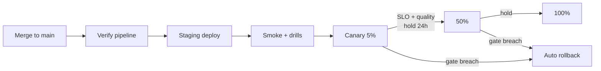

# JourneyLab — Release Plan

| Field | Value |
| --- | --- |
| Owner | TPM + Product Architect (unassigned — `BLK-001`) |
| Status | `DISCOVERY` — no release has been cut |
| Target release | **Phase 1 MVP** — one region, 3–7 day trips, deep-link handoff |
| Last reviewed | 2026-08-05 |

Navigation: [Roadmap](ROADMAP.md) · [Release readiness](../06-quality/RELEASE_READINESS_CHECKLIST.md) · [Deployment architecture](../03-architecture/DEPLOYMENT_ARCHITECTURE.md) · [Contract change policy](../04-contracts/CONTRACT_CHANGE_POLICY.md) · [00-START-HERE](../00-START-HERE.md)

---

## 1. Release taxonomy

| Type | Trigger | Gate depth | Rollback |
| --- | --- | --- | --- |
| **Patch** | Bug fix, no contract or schema change | Automated verify pipeline | Redeploy previous image |
| **Minor** | Additive contract, new endpoint, new optional field | Verify pipeline + contract compatibility check | Redeploy + flag off |
| **Major** | Breaking contract change | Full policy in [CONTRACT_CHANGE_POLICY](../04-contracts/CONTRACT_CHANGE_POLICY.md): new major version, migration guide, consumer notice, dual-run window, deprecation date | Dual-run allows consumer-side revert |
| **Model/prompt** | New model, prompt or retrieval config | AI evaluation gates ([AI_ML_EVALUATION](../06-quality/AI_ML_EVALUATION.md)) + cost/latency budget | Independent model rollback without app deploy |
| **Data/schema** | Migration | Expand/migrate/contract, backward compatible through rollout | Contract phase deferred until rollout completes |
| **Destination pack** | New or updated region data | Coverage, freshness, licence and golden-set evaluation | Disable region via flag |

**Model, data and application releases are independently rollable.** A model regression must never require an application rollback (`REQ-PLAT-012`).

---

## 2. Phase 1 release contents

| Included | Excluded (deliberately gated) |
| --- | --- |
| Coverage landing, guest/account onboarding, consent | What-if editing (`STEP-014`) |
| Trip brief with typed constraints | Collaboration and invitations (`STEP-015`) |
| Evidence pack assembly with freshness policy | Live activation, offline pack (`STEP-017`) |
| Candidate generation and CP-SAT scenario solving | Condition monitoring and replanning (`STEP-018`, `STEP-019`) |
| Monte Carlo uncertainty and diverse ranking | Post-trip learning (`STEP-020`) |
| Synchronized map/timeline/ledger comparison + accessible fallbacks | Experimentation (`STEP-022`) |
| Booking handoff via deep links with attribution | Advisor workspace (`STEP-028`) |
| Admin/curation console, observability, DSR/deletion | Payment, booking APIs, multi-region |
| Knowledge-graph platform and release automation | |

---

## 3. Rollout strategy

**Reading the diagram.** Promotion is gated by measured SLOs and quality signals at each stage, not by elapsed time alone. Any breach at canary or 50% triggers automated rollback rather than a human judgement call under pressure.

**Canary abort conditions** (any one triggers rollback):
- hard-constraint violation rate > 0
- citation correctness < 95%
- scenario generation p95 > 45 s
- API error rate exceeds error budget burn threshold
- cross-tenant authorization denial anomaly
- AI cost per trip exceeds budget by the agreed margin

---

## 4. Pre-release gates

All must pass; each maps to [RELEASE_READINESS_CHECKLIST](../06-quality/RELEASE_READINESS_CHECKLIST.md).

| Gate | Owner | Evidence required |
| --- | --- | --- |
| Product acceptance | Product Lead | All Phase 1 acceptance criteria met per step file §25 |
| Contract compatibility | Product Architect | CI compatibility report, generated clients current |
| Database/event migration | Data Architect | Expand/contract plan, rehearsed rollback |
| Security | Security Architect | Threat model closed/accepted, SAST/DAST/dependency scans clean, penetration test scheduled |
| Privacy | Privacy Owner | DSR export/deletion rehearsed and proven across all stores |
| Accessibility | Frontend Lead | WCAG 2.2 AA audit, map-free keyboard/SR journey passes |
| Observability | SRE | Dashboards, alerts, runbooks live with named owners |
| Support | Support Lead | Diagnostic bundle path tested; escalation defined |
| Cost/capacity | Engineering + Finance | Cost per saved trip measured against budget |
| Model/data | AI/ML Architect | Eval gates pass on golden + adversarial sets; rollback proven |
| **Knowledge-graph freshness** | Platform | Graph indexed at the release commit; release graph tagged immutable |
| **Blast-radius closure** | TPM | Every change in the release has a completed pre- and post-change record |
| Backup/restore | SRE | Restoration exercise completed within the quarter |
| Rollback | SRE | Automated rollback exercised in staging |

---

## 5. Release cut procedure

1. Freeze `main`; confirm no step in the release is `IN_PROGRESS` or `BLOCKED`.
2. Run the full verify pipeline including AI evaluations and data-quality checks.
3. Re-index the knowledge graph at the release commit (`npx gitnexus analyze`) and **tag an immutable release graph** (`REQ-KG-004`).
4. Confirm every changed symbol in the release has a closed blast-radius record.
5. Confirm documentation currency: every step file `§28 Completion record` populated; [MASTER_TRACKER](MASTER_TRACKER.md) rows `VERIFIED`.
6. Generate release notes from the changelog and the contract change log.
7. Deploy to staging; run drills — provider outage, stale data, solver timeout, deletion.
8. Canary per §3.
9. On completion, move steps to `RELEASED` and record the release reference in each step file.

**Commit and release-note rule:** commit messages and pull-request descriptions must not contain AI co-authorship attribution (`ADR-006`).

---

## 6. Post-release verification

Within the first 24 hours:
- confirm the end-to-end trip trace works in production (`REQ-OBS-002`)
- confirm business-quality alerts fire correctly with a synthetic probe
- confirm deletion propagation on a test account across all stores
- compare pre- and post-change graph neighborhoods for unexpected consumers or orphan nodes

Within the first week:
- review cost per saved feasible trip against budget
- review reported incorrect facts and citation failures separately from satisfaction scores
- record negative results in [DECISION_LOG](DECISION_LOG.md)

---

## 7. Current release status

**No release is scheduled.** Preconditions unmet:

| Blocker | Detail |
| --- | --- |
| `BLK-001` | No named owners; no gate can be signed off |
| `BLK-002` | No application code exists; the repository contains documentation only |
| `DEC-002` | Phase 1 destination region undecided |
| `DEC-005` | KPI thresholds undefined, so exit gates are not objectively evaluable |
| `EV-GAP-002` | Provider licence viability unproven (`RISK-001`) |
