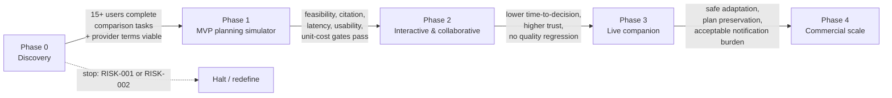

# JourneyLab — Delivery Roadmap

| Field | Value |
| --- | --- |
| Owner | TPM (unassigned — `BLK-001`) |
| Status | `DISCOVERY` — phase content defined; **durations deliberately absent** (`ASM-002`) |
| Upstream source | Blueprint §21 (Delivery roadmap and release gates) |
| Last reviewed | 2026-08-05 |

Navigation: [Scope](../01-product/PRODUCT_SCOPE.md) · [Master tracker](MASTER_TRACKER.md) · [Dependencies](DEPENDENCY_REGISTER.md) · [Release plan](RELEASE_PLAN.md) · [00-START-HERE](../00-START-HERE.md)

---

## Why there are no dates

Team size, budget and start date are unspecified (`ASM-002`). Publishing invented durations would create a false plan that others would schedule against. This roadmap therefore defines **phase content, entry conditions and exit gates**. Durations are added by the TPM once staffing is known.

---

## Phase sequence

**Reading the diagram.** Each arrow is a gate, not a hand-off. A phase cannot start because the previous one finished on a calendar; it starts because the named exit conditions were measured and met. The dashed path is real: Phase 0 can terminate the programme.

---

## Phase 0 — Discovery and destination evidence prototype

**Goal.** Prove data coverage, scenario value and willingness to compare — *before* architecture is committed (portfolio standard §7.30).

| Work | Detail | Related |
| --- | --- | --- |
| Interview travelers and advisors; observe current planning workflows | Establishes the manual-workflow baseline that `KPI-003` is measured against | `EV-GAP-001` |
| Build one destination evidence pack and a manual scenario prototype | Tests whether facts can be assembled at usable coverage and freshness | `EV-GAP-002`, `DEC-002` |
| Define constraint ontology, source licensing and evaluation corpus | The ontology is the input to `REQ-CONS-001`; the corpus becomes the release gate | `ASM-011`, `ASM-019` |
| Solver feasibility spike | Confirms CP-SAT can meet the latency budget before it is designed in | `ASM-022`, `RISK-012` |

**Exit gate.** At least 15 target users complete comparison tasks; critical evidence coverage and provider terms are viable.

**Stop conditions active:** `RISK-001`, `RISK-002`.

---

## Phase 1 — MVP planning simulator *(target release)*

**Goal.** Ship three-to-seven-day scenario generation for one region.

| Steps | Content |
| --- | --- |
| `STEP-001` … `STEP-006` | Repo governance, identity/tenancy, design system, contracts, source integrations, canonical model and events |
| `STEP-007` … `STEP-013` | Coverage landing, account/guest + consent, trip brief, evidence assembly, candidate generation, solve + simulate, visual comparison |
| `STEP-016` | Booking handoff via deep links |
| `STEP-021`, `STEP-023`, `STEP-024`, `STEP-025` | Admin/curation, security & privacy controls, observability & SRE, support/deletion/lifecycle |
| `STEP-026`, `STEP-027` | Knowledge-graph platform, release automation and controlled rollout |

**Explicitly not in Phase 1:** live trip changes, what-if editing, collaboration, experimentation, advisor workspace. Deep links only.

**Exit gate.** Feasibility, citation, latency, usability and unit-cost gates pass with pilot users:
- zero hard-constraint violations in the release evaluation corpus (`REQ-CONS-004`)
- ≥95% citation correctness on volatile facts (`KPI-004`)
- scenario generation p95 ≤ 45 s (`REQ-NFR-004`)
- map-free keyboard and screen-reader journey completes all MVP tasks (`REQ-A11Y-003`)
- provider outage and stale-data drills degrade safely without fabricated facts (`TST-DATA-003`)

---

## Phase 2 — Interactive and collaborative planning

**Goal.** Add what-if edits and group decision support.

| Steps | Content |
| --- | --- |
| `STEP-014` | Incremental recompute, scenario versions, impact preview, undo/redo |
| `STEP-015` | Collaborator proposals, votes, owner approval, anti-abuse share controls |
| `STEP-022` | Analytics, feedback loop and experimentation with exposure integrity |
| Within existing steps | Second destination pack with automated ingestion; RTL implementation; preference learning groundwork |

**Exit gate.** Materially lower time-to-decision and higher scenario trust **without quality regression** — measured against the Phase 1 baseline, not against the manual baseline.

---

## Phase 3 — Live companion

**Goal.** Activate the offline itinerary and controlled replanning.

| Steps | Content |
| --- | --- |
| `STEP-017` | Offline pack, activation, notification preferences |
| `STEP-018` | Live event matching, severity scoring, deduplicated notification |
| `STEP-019` | Protected partial replanning with explicit acceptance |
| `STEP-020` | Post-trip learning and preference correction |
| Operations | On-call rotation and provider outage playbooks in production use |

**Entry condition.** `RISK-006` safeguards implementable — otherwise Phase 3 does not ship.

**Exit gate.** Live pilot demonstrates safe adaptation, plan preservation and acceptable notification burden.

---

## Phase 4 — Commercial scale

**Goal.** Expand destinations, advisor white-label and partner economics.

| Steps | Content |
| --- | --- |
| `STEP-028` | Advisor workspace, branding, delegated access, client handoff |
| Within existing steps | Provider portfolio, affiliate reconciliation, regional infrastructure, advanced personalisation, tenant-managed keys |

**Gated:** selective booking APIs **only after** liability, security and operational review (`REQ-BOOK-005`).

**Exit gate.** Repeatable destination onboarding, positive contribution margin, partner conversion.

---

## Critical path

The longest dependency chain to a shippable Phase 1:

`STEP-001` → `STEP-002` → `STEP-004` → `STEP-005` → `STEP-006` → `STEP-010` → `STEP-011` → `STEP-012` → `STEP-013` → Phase 1 exit

**`STEP-005` is the critical-path risk concentration point.** It cannot start until `DEC-002` (region) and `EV-GAP-002` (licence terms) are closed, and it gates the entire evidence→solve→compare chain. Delay here delays everything.

`STEP-003` (design system) runs parallel to `STEP-004`/`STEP-005` but gates every user-facing step from `STEP-007` onward.

`STEP-026` (knowledge graph) is not on the critical path for features but is on the critical path for **change safety** — `REQ-KG-008` blocks merges without a pre-change record.

---

## Sequencing rules

1. **No feature step before its foundation step.** `STEP-007`+ requires `STEP-002`, `STEP-003`, `STEP-006`.
2. **No retrieval or training before data quality is certified** (portfolio standard §7.35): `STEP-010` requires `STEP-005` exit.
3. **Deterministic engines before model assistance before ML optimisation** (§7.36): `STEP-012` (CP-SAT) precedes `AI-003` explanation and precedes `AI-009` preference learning in Phase 3.
4. **One thin end-to-end path first, including telemetry, permissions, failure state and deletion** (§7.34) — this is why `STEP-023`, `STEP-024` and `STEP-025` are Phase 1, not deferred.
5. **Negative pilot results are recorded as portfolio evidence** (§7.38), not discarded.

---

## Portfolio context

The portfolio index recommends JourneyLab **second** of five products, after DemandForge, because it adds a highly visual consumer experience, map/timeline synchronization, optimisation and uncertainty without requiring transaction processing. That ordering is a portfolio-building recommendation, not a market-size ranking, and a live design partner can justify changing it.
