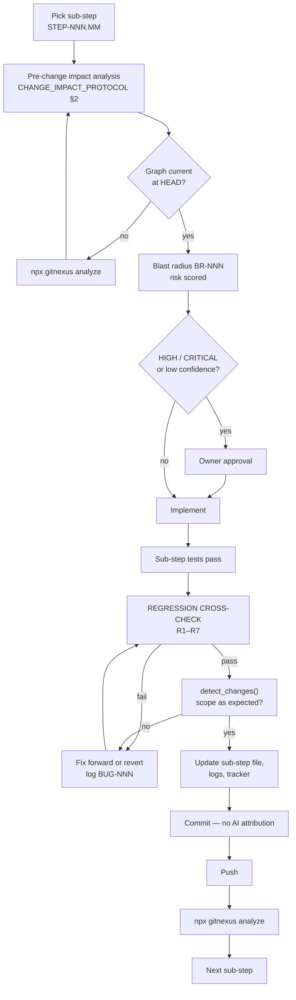

# JourneyLab — Sub-Step Protocol

> **The unit of work is the sub-step, not the step.** Every sub-step ends in a regression cross-check, a documentation update, a commit and a push.

| Field | Value |
| --- | --- |
| Owner | TPM + Platform (unassigned — `BLK-001`) |
| Status | `READY` — binding from the first implementation commit |
| Origin | Repository-owner directive, 2026-08-05 |
| Last reviewed | 2026-08-05 |

Navigation: [Master tracker](MASTER_TRACKER.md) · [Change impact protocol](../05-knowledge-graph/CHANGE_IMPACT_PROTOCOL.md) · [Sub-step template](../09-templates/SUB_STEP_TEMPLATE.md) · [Logs](../10-logs/) · [Ways of working](WAYS_OF_WORKING.md) · [00-START-HERE](../00-START-HERE.md)

---

## 1. Why sub-steps exist

A step like `STEP-012` (scenario optimisation) is weeks of work. Implementing it as one unit means:
- one enormous commit nobody can review,
- one blast-radius assessment covering changes that did not exist when it was written,
- no point at which regression is checked before the next piece is built on top,
- and no recoverable state if the approach turns out wrong halfway.

The sub-step fixes this. Each is **small enough to review, verify, commit and push independently**, and each re-verifies everything built before it.

---

## 2. Identifier scheme

| Level | ID | File |
| --- | --- | --- |
| Step | `STEP-012` | `08-steps/STEP-012-scenario-optimisation-and-simulation.md` |
| Sub-step | `STEP-012.03` | `08-steps/sub-steps/STEP-012/STEP-012.03-<slug>.md` |
| Blast radius | `BR-NNN` | `10-logs/blast-radius/BR-NNN-<slug>.md` |
| Bug | `BUG-NNN` | row in `10-logs/BUG_REGISTER.md` |
| Enhancement | `ENH-NNN` | row in `10-logs/ENHANCEMENT_LOG.md` |

Sub-step numbers are **stable and never reused**. If a sub-step is abandoned, it is marked `DROPPED` with a reason — the number is not recycled, because commits and logs reference it.

---

## 3. Sizing rules

A sub-step is correctly sized when it:

1. produces a **verifiable outcome** — something that can pass or fail a test, not "started work on X";
2. can be reviewed in a single sitting (roughly ≤ 400 changed lines of production code as a guide, not a rule);
3. leaves `main` **green and deployable** — never a half-migrated schema or a half-wired contract;
4. has its own acceptance criteria and rollback path;
5. touches one coherent concern — contract, schema, implementation, test, telemetry or documentation.

**Anti-pattern:** "implement the solver" is a step, not a sub-step. "Define the CP-SAT hard-constraint model and prove infeasibility returns a minimal conflict set" is a sub-step.

---

## 4. Standard sub-step sequence within a step

Most steps decompose along this spine. Deviate when the work genuinely differs — but never skip contract-before-implementation or test-before-done.

| # | Sub-step kind | Typical outcome |
| --- | --- | --- |
| .01 | **Contract and schema** | OpenAPI/AsyncAPI/JSON Schema additions; generated clients regenerated |
| .02 | **Data model and migration** | Expand-phase migration; entities and invariants; RLS policies |
| .03 | **Core implementation** | The deterministic domain logic, behind a flag |
| .04 | **Integration wiring** | Connect to adjacent services, workflows, events |
| .05 | **Frontend surface** | Route, components, all quality states |
| .06 | **Accessibility and failure states** | Keyboard/SR paths, map-free path, error/empty/stale states |
| .07 | **Telemetry and alerts** | Traces, metrics, dashboards, alert + runbook |
| .08 | **Security and privacy controls** | Authorization tests, redaction, deletion propagation |
| .09 | **Tests and evaluations** | Unit, contract, integration, e2e, AI evals as applicable |
| .10 | **Documentation and rollout** | Step file completion record, flag/canary plan, contract phase of migration |

---

## 5. The sub-step lifecycle



**Reading the diagram.** The regression cross-check (`J`) sits between "my code works" and "I may commit". That placement is the whole point: it is what stops sub-step 6 from silently breaking sub-step 2. A failure there loops back through a logged bug rather than being fixed invisibly.

---

## 6. The regression cross-check (R1–R7)

Required at **every** sub-step, per the repository-owner directive that previous implementations and fixes must not break. Full definitions in [CHANGE_IMPACT_PROTOCOL](../05-knowledge-graph/CHANGE_IMPACT_PROTOCOL.md) §4.

| # | Check | Pass condition |
| --- | --- | --- |
| R1 | Full regression suite — this step's completed sub-steps **and** all `VERIFIED` steps | All green; no unexplained skips |
| R2 | Contract compatibility vs. last release | No unintended breaking diff |
| R3 | Graph diff shows only intended changes | `detect_changes()` clean |
| R4 | Untested-requirement count | Not increased |
| R5 | Orphan / unowned node count | Not increased |
| R6 | Every closed bug's regression test | Still passing |
| R7 | Cross-tenant isolation | Pass — **non-negotiable** |

**If any check fails, the sub-step is not done.** Options: fix forward, or revert and re-plan. Never proceed with a red regression, and never disable a failing test to go green — that is logged as `BUG` and escalated.

---

## 7. Commit and push cadence

One sub-step = one logical commit = one push.

```bash
# after regression cross-check passes
git add -A
git commit -m "STEP-012.03: CP-SAT hard-constraint model with minimal conflict extraction

- Implements REQ-CONS-004, REQ-CONS-005
- Blast radius: BR-014 (MEDIUM)
- Regression: R1-R7 pass
- Tests: TST-CONS-004, TST-CONS-005"
git push origin <branch>
npx gitnexus analyze
```

**Commit message rules:**
- First line: `STEP-NNN.MM: <imperative summary>`
- Body: requirement IDs, blast-radius ID, regression result, test IDs
- **No AI co-authorship attribution** (`ADR-006`) — no `Co-Authored-By: Claude` trailer, no "generated with" line, in commits or PR descriptions

If a sub-step legitimately needs several commits (e.g. a large mechanical rename separated from behavioral change), keep them in one push and reference the same sub-step ID.

---

## 8. Documentation required per sub-step

Nothing is "done" until these are updated in the same commit:

| Artifact | Update |
| --- | --- |
| Sub-step file | Completion record: what changed, evidence, regression result, commit SHA |
| [IMPLEMENTATION_LOG](../10-logs/IMPLEMENTATION_LOG.md) | One entry — what was built, why, decisions taken |
| [BUG_REGISTER](../10-logs/BUG_REGISTER.md) | Any bug found or fixed, with its regression test |
| [ENHANCEMENT_LOG](../10-logs/ENHANCEMENT_LOG.md) | Any improvement beyond the requirement |
| [REGRESSION_LOG](../10-logs/REGRESSION_LOG.md) | R1–R7 results with the commit SHA |
| `10-logs/blast-radius/BR-NNN` | Post-change graph evidence section completed |
| [MASTER_TRACKER](MASTER_TRACKER.md) | Step sub-columns and `Last updated` |
| Step file | §21 checklist item ticked; §28 updated when the last sub-step lands |
| Contracts / architecture docs | If the change altered them |

---

## 9. When sub-step files are created

**Just-in-time, at step start** — not upfront for all 28 steps.

| Rationale | Detail |
| --- | --- |
| Why not upfront | Sub-step decomposition depends on decisions made during the preceding step. Writing all ~170 sub-step files now would encode guesses as plans and require rewriting most of them |
| What exists now | The **protocol** (this file), the **template**, and a **complete worked set for `STEP-001`** so the pattern is concrete rather than theoretical |
| Trigger to create | When a step moves `READY` → `IN_PROGRESS`, its owner creates the sub-step files from the template and lists them in the step file §21 |
| Constraint | Sub-step files must exist and be reviewed **before** the first line of that step's code is written |

`STEP-001` sub-steps are written and live in [`08-steps/sub-steps/STEP-001/`](../08-steps/sub-steps/STEP-001/).

---

## 10. Definition of done for a sub-step

- [ ] Pre-change impact analysis recorded, graph current at `HEAD` (or `BLOCKED` stated honestly)
- [ ] Blast radius `BR-NNN` completed and scored, approvals obtained if required
- [ ] Implementation matches the sub-step scope — no scope creep into the next sub-step
- [ ] Sub-step tests written and passing
- [ ] **Regression cross-check R1–R7 passed**
- [ ] `detect_changes()` shows only expected scope
- [ ] Documentation and logs updated
- [ ] Committed without AI attribution and pushed
- [ ] Graph re-indexed
- [ ] `main` is green and deployable
