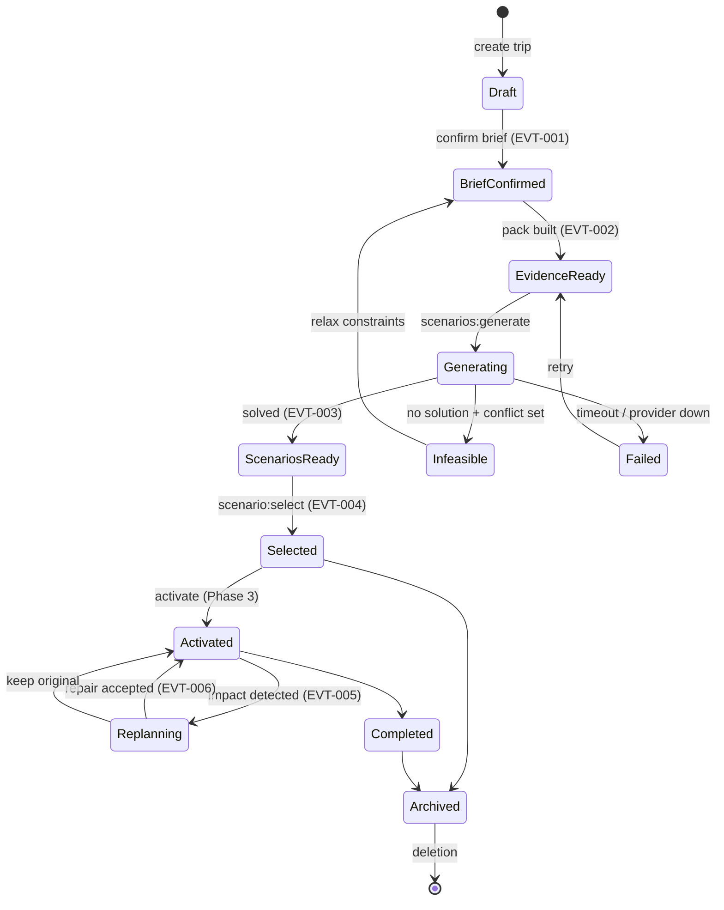

# JourneyLab — Backend Architecture

| Field | Value |
| --- | --- |
| Owner | Staff Engineer, Backend (Deepesh Kumar Gupta) |
| Status | `DISCOVERY` — target architecture; **all paths `PROPOSED`, none verified** |
| Upstream source | Blueprint §9 (Backend requirements), §10 (architecture), §11 (contracts) |
| Last reviewed | 2026-08-05 |

Navigation: [Technical architecture](TECHNICAL_ARCHITECTURE.md) · [Data](DATA_ARCHITECTURE.md) · [API contracts](../04-contracts/API_CONTRACTS.md) · [Event contracts](../04-contracts/EVENT_CONTRACTS.md) · [Operations](../07-operations/OPERATIONS_AND_SUPPORT.md) · [00-START-HERE](../00-START-HERE.md)

---

## 1. Service and module matrix

Deployed as a modular monolith plus isolated workers (`ADR-003`). "Service/Module" below is a **bounded context with an enforced import boundary**, not necessarily a separate deployable.

| Service/Module | Responsibility | Scope Steps | APIs | Events | Data Stores | Dependencies | SLO | Failure Mode | Runbook | Owner |
| --- | --- | --- | --- | --- | --- | --- | --- | --- | --- | --- |
| `identity` | Users, orgs, memberships, invitations, service accounts, RLS context | STEP-002, STEP-008 | API-001 | — | PostgreSQL | IdP (`EXT-007`) | p95 ≤ 200 ms | IdP down ⇒ fail closed, no anonymous fallback | RB-AUTH-001 | Security |
| `trip` | Trip lifecycle, briefs, members, canonical scenario pointer, export | STEP-008, STEP-009 | API-001…003 | EVT-001 | PostgreSQL | identity | p95 ≤ 400 ms | Version conflict ⇒ 409 with ETag | RB-TRIP-001 | Backend |
| `destination` | Coverage model, provider health, region metadata | STEP-007, STEP-021 | API-017 | — | PostgreSQL/PostGIS, cache | ingestion | p95 ≤ 200 ms | Stale coverage ⇒ mark region degraded, refuse new trips | RB-DATA-002 | Data |
| `evidence` | Evidence-pack assembly, coverage scoring, freshness, curator overrides | STEP-010, STEP-021 | API-004, API-016 | EVT-002 | PostgreSQL, object store | integrations, retrieval | Pack build p95 ≤ 20 s | Missing critical facts ⇒ lower confidence or block options | RB-DATA-001 | Data |
| `recommendation` | Candidate generation, eligibility, diversity | STEP-011 | — | — | PostgreSQL, cache | evidence | p95 ≤ 5 s | Sparse pool ⇒ transparent limited-choice state | RB-SOLVER-002 | Backend |
| `routing` | Time-dependent multi-mode travel matrices and cache | STEP-011, STEP-012 | — | — | PostGIS, cache | Routing provider (`EXT-003/004`) | Matrix p95 ≤ 8 s | Provider down ⇒ cached matrix marked stale; block if absent | RB-PROV-001 | Backend |
| `solver` *(worker)* | CP-SAT feasibility, multi-objective optimisation, minimal conflict extraction | STEP-012, STEP-019 | — | EVT-003 | PostgreSQL | recommendation, routing | Generation p95 ≤ 45 s | Timeout ⇒ return best-known + preserve last valid version | RB-SOLVER-001 | Backend |
| `simulation` *(worker)* | Monte Carlo over price, duration, weather, disruption | STEP-012 | — | — | PostgreSQL | solver | Within generation budget | Degrade sample count before breaching latency | RB-SOLVER-001 | Data Science |
| `ranking` | Objective-aware diversity (MMR) and preference ranking | STEP-012, STEP-020 | API-006 | — | PostgreSQL | simulation | p95 ≤ 1 s | Fall back to deterministic objective ordering | RB-AI-002 | AI/ML |
| `scenarios` | Scenario version commands: generate, edit, select | STEP-012…014 | API-005…009 | EVT-003, EVT-004 | PostgreSQL | solver | p95 ≤ 400 ms (command) | Conflicting edit ⇒ merge/review state | RB-TRIP-002 | Backend |
| `retrieval` *(worker)* | Hybrid retrieval, reranking, citations, corrective retrieval | STEP-010, STEP-013 | — | — | pgvector, PostgreSQL | evidence | p95 ≤ 3 s | Low confidence ⇒ abstain, never backfill from memory | RB-AI-001 | AI/ML |
| `ai` | Model gateway, orchestrator, tools, prompts, guardrails | STEP-009, STEP-013 | — | — | cache, object store | LLM provider (`EXT-006`) | Per-capability budget | Budget/timeout ⇒ documented non-AI fallback | RB-AI-001 | AI/ML |
| `collaboration` | Invitations, comments, votes, immutable change proposals | STEP-015 | API-010 | EVT-004 | PostgreSQL | identity | p95 ≤ 400 ms | Expired/revoked ⇒ fail closed without leaking trip data | RB-TRIP-003 | Backend |
| `affiliate` | Deep-link generation, attribution, booking reconciliation | STEP-016 | API-011 | — | PostgreSQL (segregated) | Affiliate (`EXT-005`) | p95 ≤ 500 ms | Partner down ⇒ copyable details fallback | RB-PROV-002 | Backend |
| `live` *(Phase 3)* | Impact matching, notification eligibility, replan orchestration | STEP-017…019 | API-012, API-013 | EVT-005, EVT-006 | PostgreSQL, cache | routing, solver | Impact match p95 ≤ 60 s | Unverified source ⇒ never auto-change plan | RB-LIVE-001 | Backend |
| `integrations` *(worker)* | Provider adapters, credentials, quotas, backfill, reconciliation | STEP-005 | — | — | PostgreSQL, object store | All providers | Per-provider freshness SLO | Circuit break + reconciliation checkpoint | RB-PROV-001 | Data |
| `ingestion` *(worker)* | Entity resolution, normalization, freshness policy | STEP-005, STEP-006 | — | — | PostgreSQL/PostGIS | integrations | Batch freshness SLO | Schema drift ⇒ reject, never coerce | RB-DATA-002 | Data |
| `events` | Transactional outbox publisher, idempotency, replay | STEP-006 | — | all | PostgreSQL, queue | — | Publish lag p95 ≤ 5 s | Backlog ⇒ alert + replay from checkpoint | RB-QUEUE-001 | Backend |
| `privacy` | Export, correction, consent withdrawal, deletion orchestration | STEP-025 | API-015 | — | all stores | knowledge, retrieval | Deletion within policy window | Failure ⇒ monitored retry queue visible to privacy owner | RB-PRIV-001 | Privacy |
| `knowledge` *(worker)* | Domain + code graph extraction, loading, permission-aware query | STEP-026 | API-018 | — | Graph store, pgvector | events | Refresh ≤ 10 min post-merge | Graph stale ⇒ pre-change checks `BLOCKED` | RB-KG-001 | Platform |
| `analytics` / `experiments` *(Phase 2)* | Typed event collection, cohort assignment, exposure logging | STEP-022 | — | — | Warehouse | events | — | No exposure data ⇒ results withheld | RB-OBS-001 | Data |
| `support` | Tenant-safe diagnostic bundles and correlation timelines | STEP-021, STEP-025 | — | — | read-only replicas | observability | p95 ≤ 5 s | Never widens access to satisfy a request | RB-SUP-001 | Support |

---

## 2. Domain invariants

These are enforced in the domain layer, independent of transport and persistence. Violating one is a defect regardless of what the API allows.

| Entity | Invariants |
| --- | --- |
| `TripBrief` | Immutable once confirmed. Hard/soft/inferred/unresolved are separate fields, never merged. A new brief creates a new version and does not retro-modify existing scenarios |
| `EvidencePack` | Immutable. Every contained fact carries source, observed time, effective time and confidence. A pack referenced by a scenario can never be mutated or deleted while that scenario exists |
| `Scenario` | Must reference exactly one brief version, one evidence pack, one solver configuration and one seed. Without all four it cannot be created |
| `ScenarioVersion` | Immutable itinerary DAG. Zero hard-constraint violations is a creation precondition, not a post-check |
| `ItineraryItem` | A protected or completed item cannot be modified by an automated process, only by explicit user action |
| `Trip` | Exactly zero or one canonical scenario. Setting canonical requires owner authorization and passes validation |
| `BookingReference` | Never contains payment credentials. Stored separately from the planning graph |
| `ImpactEvent` | Deduplicated by source + subject + window. An unverified source can never transition a plan |

---

## 3. State machines



**Reading the diagram.** `Infeasible` and `Failed` are distinct terminal-ish states with different recovery paths: infeasibility is a *product answer* (here is the conflict set) while failure is an *operational condition* (retry). Collapsing them would hide the difference between "your constraints conflict" and "our provider is down" — which is exactly the confusion `REQ-EVID-006` prohibits.

---

## 4. Synchronous vs asynchronous

| Work | Mode | Rationale |
| --- | --- | --- |
| Trip/brief CRUD, scenario read, selection | Synchronous | Interactive, p95 ≤ 400 ms |
| Evidence-pack build | Async + job handle + SSE | Multi-provider, unbounded latency |
| Scenario generation | Async + job handle + SSE | CP-SAT + Monte Carlo; cancellable |
| Booking reconciliation | Durable workflow | External, retryable, long-lived |
| Live impact assessment | Durable workflow | Event-triggered, multi-step |
| Deletion propagation | Durable workflow | Must traverse many stores with retries and proof |
| Graph refresh | Async on merge | Not in any user request path |

**Every durable workflow defines idempotency, compensation, timeout and manual recovery.**

---

## 5. Transactions, concurrency and events

- **Transaction boundary = one aggregate.** Cross-aggregate consistency is achieved by events, never by distributed transactions.
- **Transactional outbox**: the domain event is written in the same transaction as the state change; a publisher relays it (`REQ-DATA-008`).
- **Optimistic concurrency**: ETags on mutable resources; `If-Match` required on brief replacement and scenario edits; conflicts return 409 with the current version.
- **Idempotency**: `Idempotency-Key` required on all commands; consumers are idempotent so replay cannot duplicate effects (`REQ-DATA-009`).
- **Ordering**: events partitioned by `trip_id` so a trip's events stay ordered; cross-trip ordering is not guaranteed and must not be assumed.
- **Deduplication**: impact events deduplicated by source + subject + time window before notification.

---

## 6. Caching

| Cache | Contents | Invalidation | Rule |
| --- | --- | --- | --- |
| Travel-time matrix | Mode × time window × provider terms | Material network change; provider TTL | Cache key includes provider terms so licence-limited data is not over-retained |
| Evidence lookups | Hot place/hours facts | Field-specific freshness policy | Stale entries are **served marked**, never served silently |
| Coverage model | Region availability, provider health | On provider health change | Short TTL |
| Session/rate limit/job progress | Ephemeral | TTL | Never the only copy of business state |

---

## 7. Integrations and resilience

Every connector implements: credential rotation, rate limiting, quota budget, checkpoint/cursor state, schema validation, backfill, reconciliation against source totals, circuit breaker, and deletion behavior (`REQ-DATA-002`).

| Failure | Behavior |
| --- | --- |
| Provider timeout | Retry with capped exponential backoff and jitter; then circuit break |
| Provider schema change | Reject and alert; never coerce into the canonical model |
| Quota exhaustion | Degrade to cached data **marked stale**; block options that require fresh facts |
| Partial provider outage | Region marked degraded; new trips refused for affected coverage (`REQ-TRIP-002`) |
| Model provider failure | Route to fallback provider; then non-AI fallback (`REQ-AI-007`) |
| Solver timeout | Return best-known feasible solution or preserve last valid version; never emit an unvalidated plan |

---

## 8. Authorization and tenancy

- Tenant and actor context is resolved once at the API boundary and propagated to every call, job and event.
- Row-level security enforces tenancy at the database, so an application bug cannot silently cross tenants.
- Resource-level authorization is checked per operation against the [AUTHORIZATION_MATRIX](../04-contracts/AUTHORIZATION_MATRIX.md).
- Support access is **scoped to a single trip reconstruction** and audited; it never widens to unrestricted tenant access (`REQ-ADMIN-005`).

---

## 9. Proposed file map

**`PROPOSED` — no files exist.**

```text
apps/api/src/
├── main.py                      # composition, middleware, problem details
├── auth/dependencies.py         # authn + tenant context
├── domain/{models.py,repositories.py}
└── trips/routes.py

services/
├── identity/ evidence/ recommendation/ routing/ scenarios/ collaboration/ affiliate/ live/
├── solver/src/cp_sat.py
├── simulation/src/monte_carlo.py
├── ranking/src/diverse_ranker.py
├── retrieval/src/{ingest.py,hybrid.py,citations.py,corrective.py}
├── ai/src/{model_gateway.py,orchestrator.py,guardrails.py,tools/,prompts/}
├── integrations/src/{places,weather,transit,affiliate}/
├── ingestion/src/{entity_resolution.py,freshness.py,normalizers/}
├── events/src/outbox.py
├── knowledge/src/{domain_graph.py,graph_retriever.py}
├── privacy/src/requests.py
└── support/src/diagnostics.py

db/migrations/{001_identity_tenancy.sql,010_domain.sql}
```
