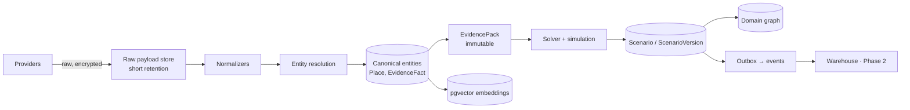

# JourneyLab — Data Architecture

| Field | Value |
| --- | --- |
| Owner | Data Architect (unassigned — `BLK-001`) |
| Status | `DISCOVERY` — target design; no schema exists |
| Upstream source | Blueprint §12 (data model and lifecycle), §9 (geospatial), §14 (privacy) |
| Last reviewed | 2026-08-05 |

Navigation: [Backend](BACKEND_ARCHITECTURE.md) · [Data contracts](../04-contracts/DATA_CONTRACTS.md) · [Retention & deletion](../07-operations/DATA_RETENTION_AND_DELETION.md) · [Domain graph](../05-knowledge-graph/DOMAIN_KNOWLEDGE_GRAPH.md) · [00-START-HERE](../00-START-HERE.md)

---

## 1. Storage selection

| Store | Purpose | Why this store | Never used for |
| --- | --- | --- | --- |
| PostgreSQL 18 | Transactional system of record | Single consistent source; strong constraints enforce domain invariants | Analytics scans at scale |
| PostGIS extension | Spatial entities, service areas, accessibility geometry, route-cache keys | **Authoritative for geography** — feasibility depends on real distance, never straight-line | Non-spatial relationships |
| pgvector extension | Hybrid content retrieval embeddings | Avoids a separate vector database at MVP scale | Exact identifier lookup (use lexical) |
| Graph store (Neo4j or PG recursive) | Trip dependencies, evidence paths, multi-hop alternatives | Multi-hop traversal for impact and "why this over that" | System of record — it is derived |
| Redis-compatible cache | Sessions, rate limits, job progress, hot lookups | Latency | **Never the only copy of business state** |
| S3-compatible object store | Raw provider payloads, exports, model artifacts, offline packs | Large immutable blobs, lifecycle policies | Queryable state |
| Warehouse (Phase 2) | Analytics, funnels, cost models | Separate from operational load | Operational reads |

**Polyglot persistence must be justified per store.** The graph and vector stores exist because multi-hop traversal and semantic retrieval are genuinely hard in plain SQL — not because they are fashionable.

---

## 2. Core entities

| ID | Entity | Grain | Key constraints | Sensitivity |
| --- | --- | --- | --- | --- |
| DATA-001 | `Organization` | One per advisor/internal org | Tenant boundary for B2B | Internal |
| DATA-002 | `User` | One per authenticated person | Locale, privacy settings, memberships. **No inferred sensitive traits** | PII |
| DATA-003 | `TravelerProfile` | One version per change | Versioned preferences + **explicit** accessibility constraints with source and consent | **Sensitive** |
| DATA-004 | `Trip` | One per journey | Owner, dates, status, canonical scenario pointer, retention policy | PII |
| DATA-005 | `TripBrief` | One immutable version per confirmation | hard/soft/inferred/unresolved kept in separate fields | PII + sensitive |
| DATA-006 | `Place` | One canonical per resolved entity | Coordinates, categories, provider identifier graph | Public/licensed |
| DATA-007 | `EvidenceFact` | One atomic claim | value, unit, source, observed time, effective time, confidence, access label | Licensed |
| DATA-008 | `EvidencePack` | One immutable per generation run | Collection + coverage report; immutable while referenced | Licensed |
| DATA-009 | `Candidate` | One per eligible option per run | Ranking features + exclusion reasons | Derived |
| DATA-010 | `Scenario` | One per objective per run | Lineage to brief, pack, solver config, seed, model versions | Derived |
| DATA-011 | `ScenarioVersion` | One immutable per edit | Itinerary DAG, costs, scores, constraints, change explanation | Derived |
| DATA-012 | `ItineraryItem` | One per timed element | Activity/transit/rest/booking/buffer; protected + completed flags | PII |
| DATA-013 | `BookingReference` | One per confirmed external booking | **Payment credentials excluded**; segregated store | **Sensitive** |
| DATA-014 | `ImpactEvent` | One deduplicated observed change | Severity, confidence, evidence, affected nodes | Derived |
| DATA-015 | `Feedback` | One per explicit outcome label | Tied to a recommendation/item + consent scope | PII |
| DATA-016 | `ConsentRecord` | One per purpose per subject | Purpose, basis, timestamp, withdrawal | **Sensitive** |

---

## 3. Temporal model

The most common source of wrong travel plans is confusing "when we learned it" with "when it is true". JourneyLab keeps three time axes distinct:

| Axis | Meaning | Example |
| --- | --- | --- |
| `observed_at` | When we retrieved the fact | Fetched hours at 09:00 today |
| `effective_from` / `effective_to` | When the fact is true in the world | Summer hours, 1 Jun – 31 Aug |
| `recorded_at` | When our system stored it | Audit and replay |

**Consequences enforced in code:**
- A freshly observed fact can still be **inapplicable** to the trip dates. Solvers filter on effective time, not observation time (`REQ-AI-003`).
- Freshness thresholds are **field-specific**: closures and disruptions expire in minutes; descriptions in weeks (`REQ-DATA-005`).
- A fact whose effective window does not cover the trip must not silently substitute for one that does — it becomes a coverage gap.

---

## 4. Data flow

**Reading the diagram.** Raw payloads are quarantined with short retention and never read by the solver; only canonical, provenance-bearing facts reach an evidence pack. The pack is the freeze point that makes a scenario reproducible. Derived stores (vectors, graph, warehouse) branch off the canonical layer, which is why deletion must traverse all of them (`REQ-PRIV-006`).

---

## 5. Data quality

| Dimension | Expectation | Failure action |
| --- | --- | --- |
| Schema | Provider payload matches the registered contract | Reject + alert; never coerce |
| Freshness | Field-specific thresholds met | Mark stale, lower confidence, or block the option |
| Completeness | Critical fields present for a place to be planning-eligible | Exclude from candidates with a stated reason |
| Uniqueness | One canonical place per real-world entity | Entity-resolution review queue |
| Referential integrity | Every itinerary item references a resolved location | **Hard block** — no item may use an unresolved location (`REQ-NFR-012`) |
| Reconciliation | Ingested totals match source totals | Backfill from checkpoint |
| Distribution drift | Price/duration distributions stay within expected bounds | Alert; recalibrate simulation |

---

## 6. Lifecycle and retention

| Data class | Retention | Deletion behavior |
| --- | --- | --- |
| Raw provider payloads | Only as long as reconciliation and dispute handling require | Hard delete on schedule |
| Canonical evidence | Per provider licence terms (`CON-002`) | Honour provider deletion requirements |
| Trip and scenario data | User-configurable within policy | Full traversal deletion |
| Precise location | **Ephemeral** — not persisted unless explicitly saved | Nothing to delete by default |
| Booking references and documents | Shorter retention, narrower access, segregated | Hard delete with the trip or earlier |
| Consent records | Retained as legally required | Retained after account deletion where law requires; documented as an exception |
| Analytics/evaluation aggregates | Must meet de-identification thresholds; **no free-form sensitive text by default** | Aggregates survive deletion only if genuinely non-identifiable |
| Audit events | Legally required minimum | Immutable; documented exception to deletion |

**Deletion traverses:** transactional rows → object storage → vector chunks → graph nodes → caches → exports → notification and offline tokens. Proven by automated test, not by assertion (`REQ-PRIV-006`).

---

## 7. Migration strategy

Expand/migrate/contract, backward compatible throughout the rollout window (`REQ-PLAT-011`):

1. **Expand** — add new columns/tables as nullable/additive; deploy readers tolerant of both shapes.
2. **Migrate** — backfill in idempotent, resumable batches with progress checkpoints.
3. **Contract** — remove the old shape only after the rollout window closes and no reader remains, verified by the code graph (`KG-Q-006`).

Destructive migrations require a blast-radius record and an owner approval; a rollback plan that loses data is not a rollback plan.

---

## 8. Tenancy

Every row carries an organization/tenant identifier, enforced by row-level security. Cache keys and event partition keys include it. Cross-tenant isolation is tested continuously, including via cache, jobs, exports and graph traversal (`REQ-SEC-002`, `REQ-KG-006`).
</content>
