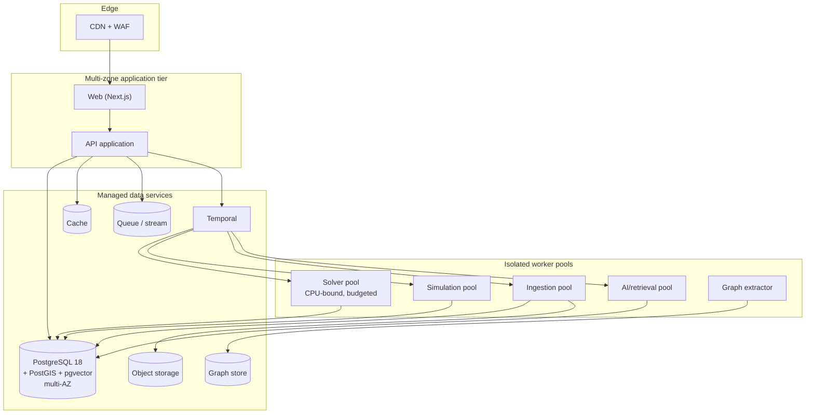

# JourneyLab — Deployment Architecture

| Field | Value |
| --- | --- |
| Owner | Product Architect + SRE (unassigned — `BLK-001`) |
| Status | `DISCOVERY` — **cloud provider, region and residency undecided (`DEC-007`)** |
| Upstream source | Blueprint §18 (deployment topology), §10 (infrastructure) |
| Last reviewed | 2026-08-05 |

Navigation: [Technical architecture](TECHNICAL_ARCHITECTURE.md) · [Release plan](../02-delivery/RELEASE_PLAN.md) · [Backup & DR](../07-operations/BACKUP_RESTORE_AND_DR.md) · [Cost & capacity](../07-operations/COST_AND_CAPACITY_MANAGEMENT.md) · [00-START-HERE](../00-START-HERE.md)

---

## 1. Topology

**Reading the diagram.** Worker pools are separated by resource profile, not by team convenience: the solver is CPU-bound and bursty, ingestion is I/O-bound and scheduled, AI work is latency-bound and cost-metered. Sharing one pool would let a solver burst starve retrieval and breach two different SLOs at once.

---

## 2. Environments

| Environment | Purpose | Data | Access |
| --- | --- | --- | --- |
| Local | Development | Synthetic fixtures only | Developer |
| CI | Automated verification | Synthetic fixtures + recorded provider payloads | Pipeline identity |
| Staging | **Production-like** rehearsal, drills, canary validation | Synthetic or de-identified; **never raw production personal data** | Restricted, audited |
| Production | Live | Real | Least privilege, audited, break-glass procedure |

**No copied secrets between environments.** Each environment has its own secret material and workload identities.

**Staging must be production-like** or the release gate is theatre: same migration path, same flag configuration mechanism, same provider sandboxes, same observability.

---

## 3. Deployment strategy

| Aspect | Approach |
| --- | --- |
| Delivery | GitOps; declarative manifests; signed artifacts with provenance |
| Strategy | Blue/green or canary (see [RELEASE_PLAN](../02-delivery/RELEASE_PLAN.md) §3) |
| Migrations | Expand/migrate/contract; backward compatible through the rollout window |
| Independence | Application, model/prompt and destination-pack rollouts are **independently deployable and rollable** |
| Flags | Feature, model, provider and cohort flags changed without deployment (`REQ-PLAT-012`) |
| Rollback | Automated, exercised in staging before production use |
| Infrastructure | Terraform/OpenTofu modules; policy-as-code for network, admission, artifact and IAM |

---

## 4. Regionality and residency

**Open decision `DEC-007`.** Documented positions, not commitments:

| Concern | Position |
| --- | --- |
| Destination packs and read models | Support regional deployment — they are licensed, non-personal data |
| Trip and traveler data | Follows residency configuration; must be able to stay in one region |
| Multi-region active-active | **Not in scope for Phase 1.** Multi-zone within one region is the MVP posture |
| Data residency obligation | Assumed absent (`ASM-003`) — this assumption is load-bearing and untested |

If residency obligations exist, storage design, provider selection and backup topology all change materially. That is why the decision blocks `STEP-027`.

---

## 5. Scaling profile

| Component | Scaling trigger | Constraint |
| --- | --- | --- |
| Web/API | Request concurrency | Stateless; scales linearly |
| Solver pool | Queue depth of generation jobs | CPU-bound; explicit per-job memory/CPU budget prevents noisy-neighbour failures |
| Simulation pool | Generation volume | Sample count is the degradation lever before latency breach |
| Ingestion | Schedule + provider quota | **Quota-bound, not compute-bound** — scaling out does not help |
| AI/retrieval | Request concurrency | Cost-bound; budget enforced per request |
| PostgreSQL | Connection and IOPS pressure | Vertical first, then read replicas for read models |
| Graph extractor | Merge frequency | Off the user request path entirely |

---

## 6. Resilience posture

| Failure | Behavior |
| --- | --- |
| Zone loss | Multi-zone application and managed data services continue |
| Region loss | **Recovery from backup, not automatic failover** in Phase 1; RTO/RPO defined in [BACKUP_RESTORE_AND_DR](../07-operations/BACKUP_RESTORE_AND_DR.md) |
| Database failure | Managed failover; application retries with backoff |
| Cache loss | Degraded latency only — cache is never the sole copy of state |
| Queue backlog | Back-pressure and alerting; replay from checkpoint |
| Provider outage | Circuit breaker; marked-stale data; block options needing fresh facts |
| Model provider outage | Failover, then non-AI fallback |
| Solver pool exhaustion | Queue with visible progress; refuse new generations rather than time out silently |

---

## 7. Preconditions before production

| Blocker | Detail |
| --- | --- |
| `DEC-007` | Cloud provider, region and residency undecided |
| `BLK-002` | No application code, IaC, pipelines or manifests exist |
| Security review | Threat model, penetration test and supply-chain controls required first |
| DR rehearsal | Restoration exercise must complete before GA |
| Runbooks | Every deployable unit needs an owner and rehearsed runbook |
</content>
