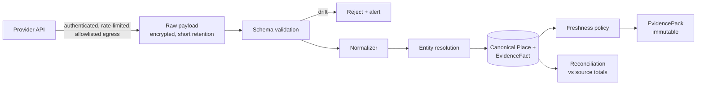

# JourneyLab — Integration Architecture

| Field | Value |
| --- | --- |
| Owner | Data Architect + Backend (unassigned — `BLK-001`) |
| Status | `DISCOVERY` — **no provider selected**; 10 of 11 external dependencies unidentified |
| Upstream source | Blueprint §9 (destination evidence and live data), §11 (contracts) |
| Last reviewed | 2026-08-05 |

Navigation: [System context](SYSTEM_CONTEXT.md) · [Integration contracts](../04-contracts/INTEGRATION_CONTRACTS.md) · [Dependencies](../02-delivery/DEPENDENCY_REGISTER.md) · [00-START-HERE](../00-START-HERE.md)

---

## 1. Connector framework

Every external integration is built on one connector framework so that resilience, provenance and licence compliance are structural rather than per-integration discipline.

| Capability | Requirement | Why |
| --- | --- | --- |
| Credential management | Secret manager, rotation, no static keys | `REQ-SEC-003` |
| Egress control | Allowlist, SSRF protection, URL validation | `REQ-SEC-005` |
| Schema validation | Registered contract per provider; reject on drift | Never coerce unknown data into canonical entities |
| Rate limit + quota budget | Per provider, per environment | Prevents one region's traffic exhausting the quota |
| Checkpoint/cursor | Resumable ingestion | Backfill without duplication |
| Circuit breaker | Trip on failure threshold | `REQ-DATA-003` |
| Reconciliation | Compare ingested totals against source | Detects silent partial ingestion |
| Provenance capture | source, observed_at, effective window, confidence, licence label | `REQ-DATA-007` |
| Deletion behavior | Honour provider deletion and attribution obligations | `CON-002` |
| Sanitized fixtures | Recorded payloads incl. quota, error and schema-change cases | Enables tests without live calls |

**A provider without all eleven is not integrated.** "It works in happy path" is not an integration.

---

## 2. Integration inventory

| ID | Integration | Direction | Pattern | Freshness class | Failure behavior | Status |
| --- | --- | --- | --- | --- | --- | --- |
| INT-001 | Places / hours / accessibility | Inbound pull + scheduled refresh | Batch + on-demand | Hours: fast expiry; descriptions: slow | Circuit break; marked-stale cache; block options needing fresh hours | **Unidentified** (`EXT-001`) |
| INT-002 | Weather forecast + normals | Inbound pull | Scheduled + per-generation | Forecast: hours | Degrade `weather_resilient` objective, disclose | Unidentified |
| INT-003 | Transit schedules + service alerts | Inbound pull / feed | GTFS-style batch + alert stream | Alerts: minutes | Fall back to walk/drive; disclose transit gap | Unidentified |
| INT-004 | Routing / travel-time matrix | Inbound request | On-demand + cache | Cached by mode/time window/terms | Cached matrix marked stale; block if absent | Unidentified (`DEC-008`) |
| INT-005 | Affiliate deep link + attribution | Outbound link, inbound callback | Link generation + signed webhook | Real time | Copyable details fallback | Unidentified (`EXT-005`) |
| INT-006 | LLM provider | Outbound request | Request/response via gateway | N/A | Failover provider → non-AI fallback | Not selected |
| INT-007 | Identity provider | Bidirectional | OIDC | N/A | Fail closed | Not selected (`DEC-004`) |
| INT-008 | Map tiles | Outbound (browser) | Tile fetch | N/A | List-only comparison | Not selected |
| INT-009 | Crowd signals | Inbound pull | Batch | Hours | Drop "quieter" preference, disclose | Unidentified; **privacy-gated** (`ASM-021`) |

---

## 3. Inbound webhook handling

Applies to affiliate attribution and any provider callback:

1. **Verify the signature** before parsing the body. An unsigned webhook is discarded, not "best-effort processed".
2. Require an event ID and creation time; **reject replays outside the accepted window**, accept duplicates idempotently.
3. Validate against the registered schema; reject on drift.
4. Enqueue for asynchronous processing — never do business work in the webhook request.
5. Record provenance and correlate to the trip without trusting the caller's tenant claim.
6. Support deliberate replay for recovery.

---

## 4. Provider data lifecycle

**Reading the diagram.** Validation precedes normalization so malformed data is rejected rather than reshaped into something plausible. Entity resolution is where multiple providers' views of the same venue converge into one canonical place — this is the step that prevents an itinerary containing the same museum twice under two names.

---

## 5. Licence and attribution compliance

| Obligation | Implementation |
| --- | --- |
| Permitted use | Recorded per source in the data inventory before ingestion (`SC-LIC-01`) |
| Cache duration | Encoded in the cache key and freshness policy; expiry enforced technically, not by convention |
| Attribution | Rendered wherever the data is displayed |
| Deletion on request | Provider-initiated deletion propagates through canonical entities, packs, vectors and graph |
| Redistribution limits | Exports respect per-source redistribution terms; an export may legitimately contain less than the UI shows |

**Open risk:** cache rights are assumed but unproven (`ASM-019`). If a provider forbids caching for the duration a scenario must remain reproducible, `ADR-004` (immutable evidence packs) conflicts with the licence and the architecture must change.

---

## 6. Provider substitution

Every provider is reached through a **provider-independent interface** so substitution does not ripple into domain logic:

- Routing: mode profiles (walk, transit, drive, wheelchair) are the interface; the engine is an implementation.
- Places: canonical `Place` is the interface; provider identifiers are attributes, not keys.
- Weather: forecast + normals with confidence, not a vendor payload shape.
- LLM: gateway with structured output, not a provider SDK in domain code.

Provider concentration is tracked as `RISK-008`; second-source evaluation is required before Phase 2 coverage expansion.
