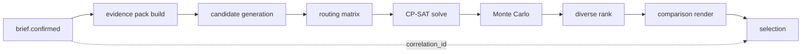

# JourneyLab — Observability Architecture

| Field | Value |
| --- | --- |
| Owner | SRE (unassigned — `BLK-001`) |
| Status | `DISCOVERY` |
| Upstream source | Blueprint §18 (observability), §15 (NFRs), portfolio standard §4.23 |
| Last reviewed | 2026-08-05 |

Navigation: [NFRs](NON_FUNCTIONAL_REQUIREMENTS.md) · [Operations](../07-operations/OPERATIONS_AND_SUPPORT.md) · [Runbooks](../07-operations/RUNBOOK_INDEX.md) · [Incident response](../07-operations/INCIDENT_RESPONSE.md) · [00-START-HERE](../00-START-HERE.md)

---

## 1. Principles

1. **Every deployable unit has SLOs, dashboards, alerts, a runbook, an owner, a rollback path and documented data-deletion behavior before GA** (portfolio standard §4.23).
2. **Correlation without exposure.** Traces carry tenant-safe correlation IDs; they never carry trip content, evidence text, prompts or personal data.
3. **Business quality is observable, not just infrastructure health.** A system with perfect uptime that emits uncited facts is failing.
4. **Every alert names a runbook and an owner.** An alert nobody owns is deleted or fixed, not tolerated.
5. **OTel GenAI semantic conventions are version-pinned**, because they continue to evolve.

---

## 2. Signal model

| Signal | Contents | Retention |
| --- | --- | --- |
| Traces | Request → domain → worker → provider/model → result, with route templates, SQL fingerprints, topic names, model call spans | Short, sampled with tail-based retention of errors and slow traces |
| Metrics | RED per route, queue depth/lag, solver saturation, provider latency/quota, model cost/latency, freshness age-at-use | Long |
| Logs | Structured, correlation-bearing, redacted | Medium |
| Audit events | Immutable security and business events, **stored separately** | Legally required minimum |
| AI traces | Prompt version, model version, retrieval config, source pack ID, tool results, cost, latency — sensitive fields redacted | Medium; feeds the evaluation regression loop |

**Redaction is applied at emission**, not at query time. A payload that never enters telemetry cannot leak from it.

---

## 3. The trip correlation trace

The single most valuable diagnostic artifact: one trip's journey from brief to rendered result.

**Reading the diagram.** A single correlation ID spans every stage, so support can answer "why did this user get these three scenarios" without reading their trip content — the trace carries IDs and versions, not payloads. This is what makes `REQ-ADMIN-005` (diagnose one trip without unrestricted tenant access) achievable.

---

## 4. Dashboards

| Dashboard | Audience | Key panels |
| --- | --- | --- |
| API health | SRE | RED per route, error budget burn, latency percentiles excluding provider time |
| Provider health | Data, Ops | Per-provider latency, error rate, quota consumption, circuit-breaker state, reconciliation deltas |
| Evidence freshness | Data | Age-at-use per field class, stale-fact rate, coverage gaps per region |
| Solver | Backend | Generation duration, saturation, timeout rate, **infeasibility reasons**, conflict-set sizes |
| AI quality & cost | AI/ML | Citation correctness, groundedness, abstention rate, tokens and cost per trip, budget breaches |
| Frontend experience | Frontend | Core Web Vitals, map/chart error rate, **accessibility failures**, user-reported incorrect facts |
| Queue & workflow | Backend | Outbox lag, DLQ depth, workflow retries and stuck instances |
| Knowledge graph | Platform | Index freshness after merge, coverage %, unresolved calls, extraction gaps |
| Privacy | Privacy owner | Deletion completion rate, retry-queue depth, DSR turnaround |
| Business KPIs | Product | KPI-001…009 with guardrail panels adjacent to primary metrics |

**Guardrails are displayed next to the metric they constrain.** Separating them lets someone celebrate a KPI while its guardrail is breached.

---

## 5. Alerts

| Alert | Condition | Severity | Runbook |
| --- | --- | --- | --- |
| `ALRT-SOLVER-002` | Any hard-constraint violation in delivered scenarios | **SEV1** | RB-SOLVER-001 |
| `ALRT-AI-001` | Citation correctness < 95% over the window | SEV2 | RB-AI-001 |
| `ALRT-DATA-001` | Evidence freshness breach for a critical field class | SEV2 | RB-DATA-001 |
| `ALRT-PROV-001` | Provider circuit breaker open / quota exhausted | SEV2 | RB-PROV-001 |
| `ALRT-SOLVER-001` | Generation p95 > 45 s or saturation sustained | SEV2 | RB-SOLVER-001 |
| `ALRT-API-001` | Error-budget burn rate exceeds threshold | SEV2 | RB-API-001 |
| `ALRT-QUEUE-001` | Outbox lag or DLQ depth above threshold | SEV2 | RB-QUEUE-001 |
| `ALRT-SEC-001` | Cross-tenant authorization denial anomaly | **SEV1** | RB-SEC-001 |
| `ALRT-PRIV-001` | Deletion failure retry queue non-empty beyond window | SEV2 | RB-PRIV-001 |
| `ALRT-KG-001` | Graph refresh lag > 10 min after merge | SEV3 | RB-KG-001 |
| `ALRT-COST-001` | Cost per saved trip exceeds budget | SEV3 | RB-COST-001 |
| `ALRT-A11Y-001` | Automated accessibility failures detected in production | SEV3 | RB-FE-001 |

**Two SEV1 conditions are product-quality, not availability:** a hard-constraint violation and a cross-tenant anomaly. Both can occur while every uptime dashboard is green — which is precisely why they are alerted.

---

## 6. Business SLIs

| SLI | Definition | Threshold |
| --- | --- | --- |
| Hard-constraint violation rate | Violating scenarios / delivered | **0** |
| Citation correctness | Correct claim-to-source spans / volatile claims | ≥ 95% |
| Abstention appropriateness | Abstentions on genuinely sparse evidence / all abstentions | Baseline from evaluation |
| Evidence freshness | Facts within threshold at time of use | Per field class |
| Scenario diversity | Material difference across the returned set | Baseline from golden packs |
| Plan preservation (Phase 3) | Preserved nodes / nodes before replan | Baseline |

---

## 7. Telemetry privacy rules

| Rule | Reason |
| --- | --- |
| No trip content, place names as free text, or evidence prose in telemetry | Trip data is personal data |
| No prompts or completions stored raw in traces; store versions and IDs plus redacted excerpts | Prompts contain user constraints |
| No precise location in any telemetry | `REQ-PRIV-008` |
| Correlation IDs are tenant-safe and non-reversible to a person | `REQ-OBS-001` |
| Analytics events are typed and carry a privacy tier; untyped events rejected server-side | `REQ-OBS-005` |
| Accessibility, age and location never in analytics payloads | `REQ-PRIV-004` |
</content>
