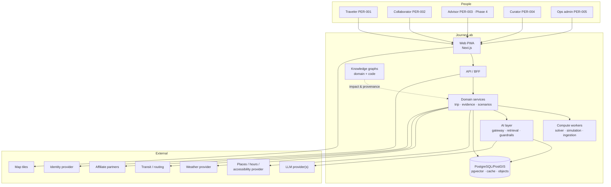

# JourneyLab — System Context

| Field | Value |
| --- | --- |
| Owner | Product Architect (unassigned — `BLK-001`) |
| Status | `DISCOVERY` — no system exists; this is the target context |
| Upstream source | Blueprint §10 (architecture), §11 (contracts), §14 (security) |
| Last reviewed | 2026-08-05 |

Navigation: [Technical architecture](TECHNICAL_ARCHITECTURE.md) · [Integration architecture](INTEGRATION_ARCHITECTURE.md) · [Security](SECURITY_PRIVACY_RESPONSIBLE_AI.md) · [00-START-HERE](../00-START-HERE.md)

---

## 1. Context diagram



**Reading the diagram.** All five personas share one web surface with role-scoped capability, not five applications. The API/BFF is the only entry point to domain services — no client talks to a provider or a model directly, which is what makes egress allowlisting and prompt-injection defence enforceable in one place. Compute workers are separated from the request path so a solver timeout degrades one job rather than API availability. The knowledge graphs are shown with a dashed edge because they are an engineering and explanation aid, not a transactional dependency: the product must function if the graph is unavailable.

---

## 2. External systems

| System | Direction | Data exchanged | Trust | Failure behavior | Contract |
| --- | --- | --- | --- | --- | --- |
| Places/hours/accessibility provider (`EXT-001`) | Inbound pull | Place entities, opening hours, closures, accessibility attributes, price ranges | **Untrusted content**, contractual source | Circuit break; bounded cached data clearly marked stale; block affected options | [INTEGRATION_CONTRACTS](../04-contracts/INTEGRATION_CONTRACTS.md) `INT-001` |
| Weather provider (`EXT-002`) | Inbound pull | Forecast, alerts, historical normals | Untrusted content | Degrade `weather_resilient` objective and disclose | `INT-002` |
| Transit / routing (`EXT-003`, `EXT-004`) | Inbound pull | Routes, schedules, service alerts, travel-time matrices, wheelchair profiles | Untrusted content | Fall back to walking/driving; disclose transit or accessibility gap | `INT-003` |
| Affiliate partners (`EXT-005`) | Outbound deep link + inbound attribution | Dates, party size, product identifiers; attribution callbacks | Untrusted callback — signature required | Copyable booking details fallback (`REQ-BOOK-004`) | `INT-004` |
| LLM provider(s) (`EXT-006`) | Outbound request | Prompt, retrieved evidence (redacted), schema | **Untrusted output** — validated before use | Provider failover; structured-form entry replaces conversational brief | `INT-005` |
| Identity provider (`EXT-007`) | Bidirectional | OIDC tokens, passkey assertions | Trusted for identity assertion only | Authentication unavailable = fail closed | `INT-006` |
| Map tile service (`EXT-009`) | Outbound | Tile requests, no trip content | Untrusted content | List-only comparison (already required by `REQ-A11Y-003`) | `INT-007` |
| Object storage / cache / queue | Internal-managed | Documents, artifacts, sessions, jobs | Trusted infrastructure | Never sole copy of business state | — |

**Rule:** every external system is reached through a connector applying SSRF protection, an egress allowlist, schema validation, a rate limit and a timeout (`REQ-SEC-005`). No exceptions, including model providers.

---

## 3. Trust boundaries

| Boundary | Crosses | Control |
| --- | --- | --- |
| Browser ↔ API | User input, session tokens | OIDC/OAuth 2.1, short-lived tokens, CSP, server-side authorization on every operation (`REQ-SEC-004`) |
| API ↔ domain services | Tenant and actor context | Tenant ID propagated on every call, row-level security at the database (`REQ-SEC-001`) |
| Domain ↔ external providers | Provider payloads | Egress allowlist, schema validation, provenance capture, circuit breakers |
| Domain ↔ model gateway | Prompts and retrieved evidence | Redaction, budget, structured schema, tool allowlist; **model output cannot mutate state** (`REQ-AI-001`) |
| Retrieved content ↔ model context | Untrusted text | Instruction/data isolation, injection detection (`REQ-AI-009`) |
| Tenant ↔ tenant | Any data | Continuous isolation tests; permission-aware graph traversal (`REQ-KG-006`) |
| Planning graph ↔ booking documents | Travel documents, booking references | Separate store, narrower access, shorter retention (`REQ-SEC-010`) |
| Application ↔ audit log | Security and business events | Immutable, separate from application logs (`REQ-SEC-007`) |

---

## 4. Primary runtime flow

```text
Traveler intent → typed TripBrief → evidence-pack build
  → candidate generation → hard filters → route/time matrix
  → CP-SAT scenario solver → Monte Carlo simulation → diverse ranker
  → scenario versions → map/timeline comparison → explicit selection
  → booking handoff → live event matching → approved partial replan
  → post-trip feedback → preference and evaluation datasets
```

Each arrow is an immutable artifact handoff, not a mutation. That is what makes `REQ-CONS-006` (reproducibility) achievable: any stage can be replayed from its stored input, model versions and seed.

---

## 5. What the system deliberately does not do

| Not done | Why | Reference |
| --- | --- | --- |
| Hold inventory or process payment | Not merchant of record | `EXC-001` |
| Let a model write trip state | Deterministic engines own feasibility | `ADR-002`, `REQ-AI-001` |
| Call providers during solve | Reproducibility requires frozen evidence | `ADR-004` |
| Store precise location by default | Privacy and stalking risk | `REQ-PRIV-008`, `RISK-006` |
| Serve a graph path the caller cannot inspect at source | Permission integrity | `REQ-KG-006` |
