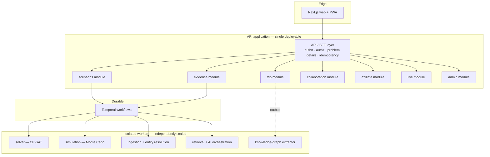

# JourneyLab — Technical Architecture

| Field | Value |
| --- | --- |
| Owner | Product Architect (Deepesh Kumar Gupta) |
| Status | `DISCOVERY` — target architecture; nothing implemented |
| Upstream source | Blueprint §10 (technology baseline), portfolio standard §4–5 |
| Baseline validity | **August 2026.** Revalidate every version before pinning (`ASM-004`, `CON-007`) |
| Last reviewed | 2026-08-05 |

Navigation: [System context](SYSTEM_CONTEXT.md) · [Frontend](FRONTEND_ARCHITECTURE.md) · [Backend](BACKEND_ARCHITECTURE.md) · [Data](DATA_ARCHITECTURE.md) · [AI/ML](AI_LLM_RAG_ML_ARCHITECTURE.md) · [Deployment](DEPLOYMENT_ARCHITECTURE.md) · [00-START-HERE](../00-START-HERE.md)

---

## 1. Technology baseline

Versions are the **documented baseline as of August 2026**, not a licence for continuous churn (portfolio standard §4.18). Each must be revalidated at implementation time and pinned by lock file (`REQ-PLAT-002`).

| Layer | Selection | Rationale | Decision status |
| --- | --- | --- | --- |
| Web framework | Next.js 16.2 (App Router) | Server components for read-heavy coverage/SEO pages; streaming for long solver runs; one framework for public and authenticated surfaces | Confirmed (blueprint) |
| UI runtime | React 19.2 (current patched), React Compiler where supported | Baseline stable line | Confirmed |
| Language (web) | **TypeScript 7.0.2** strict | Strict-by-default typing. **Supersedes the blueprint's 6.0 baseline** — 7.0.2 is `latest` at implementation time, per portfolio standard §4.18 (current stable) | **`ADR-009`** |
| Styling | Tailwind CSS 4.3 + accessible headless components | Utility baseline; headless components stay independently testable for WCAG | Confirmed |
| Web runtime | Node.js 24 LTS | Supported server/build runtime | Confirmed |
| Application services | Python 3.14 + FastAPI/Pydantic | Optimisation, ML, retrieval and data-intensive services; OR-Tools and the scientific stack live here | Confirmed |
| Integration adapters | TypeScript permitted | Where shared types with the frontend materially reduce risk | Confirmed |
| Transactional store | PostgreSQL 18 + PostGIS + pgvector | Single source of truth; spatial entities and hybrid retrieval without extra systems | Confirmed |
| Graph | Neo4j 2026.01+ **or** PostgreSQL recursive queries | Only where multi-hop traversal is central; polyglot persistence must be justified, not assumed | **Open** — `STEP-026` design review |
| Streaming | Kafka 4.3, or a managed queue at MVP scale | AsyncAPI contracts preserved either way | **Open** — `DEC-009` |
| Cache | Redis-compatible managed cache | Sessions, rate limits, job progress, hot lookups. **Never the only copy of business state** | Confirmed |
| Object storage | S3-compatible, encrypted | Source documents, model artifacts, exports, large immutable inputs | Confirmed |
| Workflow | Temporal durable workflows | Multi-step retryable processes: pack builds, scenario generation, booking reconciliation, replanning | Confirmed |
| Solver | OR-Tools CP-SAT | Schedule feasibility and multi-objective optimisation | Confirmed |
| AI platform | Provider-neutral gateway, structured outputs, hybrid retrieval, reranking, prompt/version registry, MLflow 3 tracing | Avoids provider lock-in; makes evaluation and lineage possible | Confirmed |
| Observability | OpenTelemetry 1.43 semantic conventions | GenAI conventions must be **version-pinned** because they continue to evolve | Confirmed |
| Knowledge graph | GitNexus (code) + product-specific domain graph | Verified installed and indexing | `ADR-005` |
| IaC / delivery | Terraform or OpenTofu, GitOps, signed artifacts, policy-as-code | Reproducible environments, supply-chain integrity | Confirmed |

---

## 2. Architectural style

**Modular monolith plus isolated compute workers** (`ADR-003`).

**Reading the diagram.** One deployable application keeps transaction boundaries simple and avoids distributed-transaction complexity at MVP volume. The modules have enforced import boundaries so the monolith can be split later without a rewrite. Everything with unbounded or spiky CPU cost — solving, simulation, ingestion, embedding — runs as a worker behind a durable workflow, so the API's p95 is not hostage to a solver's worst case.

**Enforcement:** module boundaries are checked in CI. A cross-module import that bypasses a public module interface fails the build. Without this, `ADR-003` degrades into a big ball of mud and the future split becomes impossible.

---

## 3. Product-specific architecture rules

1. **Trip API owns** trip briefs, traveler assignments, scenario versions and canonical state. No other module writes them.
2. **Evidence Builder** resolves destination entities and produces immutable evidence-pack versions. **Solvers never query arbitrary web content directly** (`ADR-004`).
3. **Recommendation Service** produces candidates; **Constraint Solver** verifies feasibility; **Simulation Service** quantifies uncertainty; **Scenario Ranker** preserves objective diversity. These are four distinct responsibilities and must not be merged — merging them is how feasibility gets traded for attractiveness.
4. **PostGIS is authoritative** for spatial entities and route inputs. The graph represents dependencies and alternatives; **pgvector** supports hybrid content retrieval.
5. **Live Event Processor** matches closures, weather and transit events to itinerary nodes and starts a durable impact-assessment workflow.
6. **The model gateway** applies budgets, structured schemas and fallbacks. Model output cannot modify trip state without command validation and user authorization (`REQ-AI-001`).

---

## 4. Cross-cutting concerns

| Concern | Approach | Requirement |
| --- | --- | --- |
| Identity & tenancy | Tenant ID in every row, event and cache key; row-level security; workload identity for services | `REQ-SEC-001` … `REQ-SEC-004` |
| API style | Contract-first OpenAPI 3.1; RFC 9457 problem details; idempotency keys; ETags; cursor pagination | `REQ-PLAT-005` |
| Events | AsyncAPI with explicit delivery guarantee; transactional outbox; idempotent consumers | `REQ-DATA-008` … `REQ-DATA-010` |
| Long operations | Job handle within 500 ms + SSE progress + cancellation | `REQ-NFR-003` |
| Configuration | Feature, model, provider and cohort flags changeable without deploy | `REQ-PLAT-012` |
| Secrets | Managed secret store; no static keys; rotation | `REQ-SEC-003` |
| Observability | OTel traces/metrics/logs with tenant-safe correlation; model, retrieval, queue and pipeline telemetry | `REQ-OBS-001` |
| Reproducibility | Store solver inputs, configuration, model versions and seed | `REQ-CONS-006` |
| Documentation | Architecture decisions recorded as ADRs; code graph refreshed on merge | `REQ-PLAT-004`, `REQ-KG-003` |

---

## 5. Technology choices deliberately avoided

| Avoided | Why |
| --- | --- |
| Microservices at MVP | No scaling, ownership or failure-isolation pressure yet; cost without benefit (`ADR-003`) |
| LLM-orchestrated planning agent deciding feasibility | Unreproducible and unverifiable against `REQ-CONS-004` (`ADR-002`) |
| Straight-line distance as a feasibility proxy | Produces itineraries that fail in the real world; blueprint §13.167 forbids it |
| Vector-only retrieval | Loses exact matching on names, codes and identifiers; hybrid retrieval is required |
| Neo4j by default | Polyglot persistence must be justified; simple relationships stay in PostgreSQL |
| Client-side authorization as a control | Presentation only; server-side enforcement is the control (`REQ-SEC-004`) |
| Caching as a system of record | Cache is never the only copy of business state |

---

## 6. Verified environment facts

Recorded from direct execution on 2026-08-05, not assumed:

| Fact | Value |
| --- | --- |
| Repository | `/Users/deepeshgupta/Projects/journeylab`, git initialised, remote `https://github.com/deepeshgupta12/journeylab.git` |
| Application source files | **0** — repository contains documentation only |
| Contracts on disk | **None** — no OpenAPI, AsyncAPI, JSON Schema, migrations, CI or IaC |
| Knowledge graph | GitNexus indexed: ~1,860 nodes, ~2,535 edges — **Markdown documentation only** |
| Node.js available | v25.9.0 (note: **newer than the Node 24 LTS baseline**; the runtime for the application must be pinned to 24 LTS regardless of the local version) |

**Consequence:** every path in this document and in the step files is `PROPOSED`. None has been verified against source.
