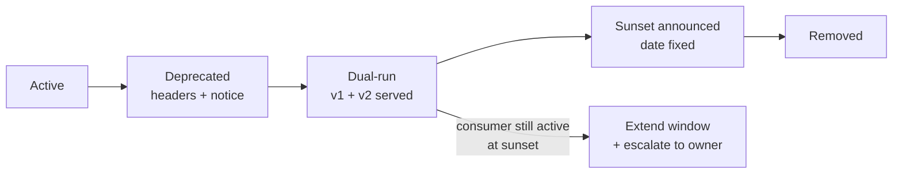

# JourneyLab — Contract Change Policy

| Field | Value |
| --- | --- |
| Owner | Product Architect (Deepesh Kumar Gupta) |
| Status | `READY` — policy is binding from the first contract commit |
| Upstream source | Blueprint §11 (contract governance), portfolio standard §4.19 |
| Last reviewed | 2026-08-05 |

Navigation: [API contracts](API_CONTRACTS.md) · [Event contracts](EVENT_CONTRACTS.md) · [API change template](../09-templates/API_CHANGE_TEMPLATE.md) · [Change impact protocol](../05-knowledge-graph/CHANGE_IMPACT_PROTOCOL.md) · [00-START-HERE](../00-START-HERE.md)

---

## 1. Scope

This policy governs changes to: REST APIs, domain events, JSON Schemas, database schemas that back a contract, webhook payloads, generated clients, and the **semantics** of any field in the above.

**Semantic change is the most dangerous category.** Changing what a field means while keeping its name and type passes every automated compatibility check and breaks every consumer. It is always treated as breaking.

---

## 2. Compatibility classification

| Class | Examples | Requirement |
| --- | --- | --- |
| **Non-breaking (additive)** | New optional request field; new response field; new endpoint; new event type; new enum value **on a field consumers do not branch on** | Compatibility check + consumer notice in release notes |
| **Potentially breaking** | New enum value on a field consumers branch on; tightened validation; new required header; changed default; changed pagination size | Treated as breaking unless consumer analysis proves otherwise via the code graph |
| **Breaking** | Remove/rename field or endpoint; change type; change semantics; change error code meaning; change delivery guarantee; change partition key; make an optional field required | Full procedure §3 |

---

## 3. Breaking-change procedure

A breaking change requires **all** of the following before merge:

1. **New major version** — `/v2/` for APIs, `.v2` for events. The old version keeps working.
2. **Consumer identification** — enumerate every known consumer using the code graph (`KG-Q-004` inbound dependencies) plus generated-client usage. **Unknown consumer coverage must be stated explicitly, not assumed to be zero.**
3. **Migration guide** — concrete before/after examples, not prose.
4. **Consumer notice** — issued before the dual-run window opens.
5. **Dual-run window** — both versions served simultaneously; length set by the slowest known consumer, minimum one full release cycle.
6. **Explicit deprecation date** — published via `Deprecation` and `Sunset` headers.
7. **Blast-radius record** — completed per [CHANGE_IMPACT_PROTOCOL](../05-knowledge-graph/CHANGE_IMPACT_PROTOCOL.md), using [API_CHANGE_TEMPLATE](../09-templates/API_CHANGE_TEMPLATE.md).
8. **Owner approval** — API owner plus one reviewer from each affected consumer team.
9. **Rollback plan** — including how consumers revert.

**A breaking change may not be bundled with unrelated changes.** It ships alone so its rollback is clean.

---

## 4. CI enforcement

| Check | Behavior on failure |
| --- | --- |
| OpenAPI/AsyncAPI diff against the previous release | Breaking diff without a version bump ⇒ **build fails** |
| Generated clients regenerated and committed | Drift ⇒ build fails |
| Hand-edited generated file | **Build fails** (`REQ-PLAT-007`) |
| Example validation | Examples must validate against their schema |
| Consumer-driven contract tests | Partner and webhook contract suites must pass |
| Deprecation metadata | A deprecated operation without a `Sunset` date ⇒ build fails |
| Change-impact record present | Missing pre-change record ⇒ **merge blocked** (`REQ-KG-008`) |

---

## 5. Deprecation lifecycle

**Reading the diagram.** Removal is gated on observed consumer traffic, not on the calendar. The `F` branch exists because the common failure mode is removing an endpoint on schedule while a consumer is still calling it — the graph and runtime telemetry together are what make that observable rather than hypothetical.

---

## 6. Versioning rules

| Artifact | Scheme |
| --- | --- |
| REST API | Major version in path (`/v1/`) |
| Events | Major version in the type name (`.v1`); additive changes bump `schema_version` |
| JSON Schema | `$id` includes the version |
| Database | Migration numbering, expand/migrate/contract |
| Models/prompts | Content-addressed versions, independently rollable |
| Destination packs | Versioned per region with an effective date |

---

## 7. Documentation obligations

Every contract change must update, in the same pull request:

- the OpenAPI/AsyncAPI/JSON Schema file (authoritative),
- [API_CONTRACTS](API_CONTRACTS.md) or [EVENT_CONTRACTS](EVENT_CONTRACTS.md) (explanatory),
- [CHANGELOG](../02-delivery/CHANGELOG.md) with the compatibility classification,
- the affected step file's §13,
- [REQUIREMENTS_TRACEABILITY](../01-product/REQUIREMENTS_TRACEABILITY.md) if a requirement's artifact changed.

**Commit rule (`ADR-006`):** commit messages and pull-request descriptions must not contain AI co-authorship attribution.

---

## 8. Emergency changes

A security fix may bypass the dual-run window **only** with: an incident record, the security owner's approval, an immediate consumer notice, and a retrospective within five working days. Everything else in this policy — versioning, blast-radius record, rollback plan — still applies. Speed is bought from the deprecation window, never from the safety analysis.
