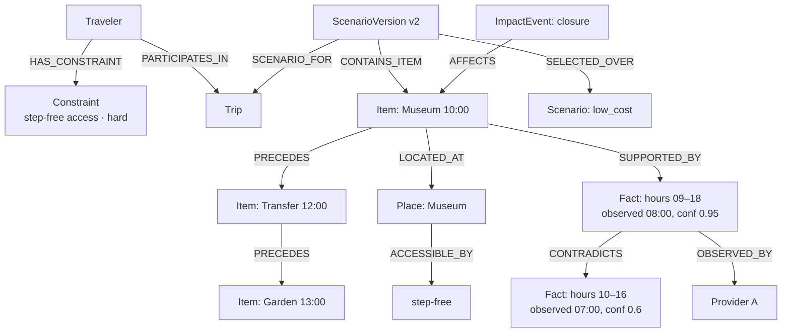

# JourneyLab — Product Domain Knowledge Graph

| Field | Value |
| --- | --- |
| Owner | Data Architect (unassigned — `BLK-001`) |
| Status | `DISCOVERY` — specified; **not built.** Implemented in `STEP-026` |
| Upstream source | Blueprint §20 (domain graph), §13 (GraphRAG) |
| Last reviewed | 2026-08-05 |

Navigation: [Schema](KNOWLEDGE_GRAPH_SCHEMA.md) · [Code graph](CODEBASE_KNOWLEDGE_GRAPH.md) · [Query playbook](GRAPH_QUERY_PLAYBOOK.md) · [Data architecture](../03-architecture/DATA_ARCHITECTURE.md) · [00-START-HERE](../00-START-HERE.md)

---

## 1. Why the domain needs a graph

Three product requirements are impractical in relational queries alone:

| Requirement | Graph question |
| --- | --- |
| Live impact matching (`REQ-LIVE-003`) | "This venue just closed — which itinerary items, in which trips, become infeasible, and what transfers depended on them?" |
| Explanation (`REQ-EVID-004`) | "Why was this activity selected over the alternatives — through which constraints and which evidence?" |
| Curator override safety (`REQ-ADMIN-003`) | "If I correct this fact, which scenarios does it invalidate?" |

Each is a multi-hop traversal over heterogeneous relationships. **This is not a claim that Neo4j is required** — PostgreSQL recursive CTEs may suffice at MVP depth. The store decision is deliberately open (`STEP-026`), but the *model* is required either way.

**GitNexus does not serve this graph.** It indexes code, not tenant product data (`ADR-005`).

---

## 2. Node types

| Node | Key properties | Sensitivity |
| --- | --- | --- |
| `Traveler` | pseudonymous ID, locale, party role | PII |
| `Preference` | dimension, weight, source, consent reference | Sensitive if accessibility-related |
| `Constraint` | class (hard/soft/inferred/unresolved), value, unit, priority, **source**, sensitivity | **Sensitive** |
| `Trip` | dates, status, region, retention policy | PII |
| `TripBrief` | version, confirmed_at | PII + sensitive |
| `Scenario` | objective label, score components, seed, model versions | Derived |
| `ScenarioVersion` | version, change explanation, feasibility result | Derived |
| `Place` | canonical ID, coordinates, categories | Licensed |
| `Activity` / `Accommodation` | duration, category, accessibility attributes | Licensed |
| `TransitStop` / `RouteSegment` | mode, duration, transfer count, profile | Licensed |
| `EvidenceFact` | value, unit, confidence, access label | Licensed |
| `SourceDocument` / `Provider` | source identity, licence | Internal |
| `FreshnessPolicy` | field class, threshold | Internal |
| `ItineraryItem` | start/end local time, protected, completed | PII |
| `BookingReference` | provider reference (**no payment data**) | Sensitive |
| `ImpactEvent` | severity, confidence, time to impact | Derived |
| `Feedback` | label, consent scope | PII |

## 3. Edge types

| Edge | From → To | Meaning |
| --- | --- | --- |
| `HAS_CONSTRAINT` | Traveler → Constraint | Declared, with source |
| `PREFERS` / `EXCLUDES` | Traveler → Place/Activity/Category | Weighted or hard exclusion |
| `PARTICIPATES_IN` | Traveler → Trip | Membership with role |
| `SCENARIO_FOR` | Scenario → Trip | |
| `VERSION_OF` | ScenarioVersion → Scenario | |
| `CONTAINS_ITEM` | ScenarioVersion → ItineraryItem | |
| `PRECEDES` | ItineraryItem → ItineraryItem | **Ordering dependency — the backbone of partial replanning** |
| `LOCATED_AT` | Activity → Place | |
| `CONNECTED_BY` | Place → Place (via RouteSegment) | |
| `REQUIRES_TRANSFER` | RouteSegment → TransitStop | Transfer risk (IATA evidence `EV-003`) |
| `ACCESSIBLE_BY` | Place/RouteSegment → profile | Accessibility support, **explicitly declared** |
| `SUPPORTED_BY` | ItineraryItem/Scenario → EvidenceFact | Justification |
| `CONTRADICTS` | EvidenceFact → EvidenceFact | **Disagreement preserved, never averaged** |
| `OBSERVED_BY` | EvidenceFact → Provider | Provenance |
| `VALID_DURING` | EvidenceFact → time window | Effective validity |
| `AFFECTS` | ImpactEvent → ItineraryItem | Live impact |
| `REPLACES` / `PRESERVES` | ScenarioVersion → ItineraryItem | Replan outcome |
| `SELECTED_OVER` | Scenario → Scenario | **Decision record — why this and not that** |

---

## 4. Worked example

**Reading the diagram.** One closure event on the museum propagates along `AFFECTS` → `PRECEDES` to show that the transfer and the garden visit are also at risk — the transfer only made sense from that origin. Simultaneously, the `CONTRADICTS` edge shows the traveler that two providers disagree on opening hours, with observation times and confidence, rather than silently picking one. The `ACCESSIBLE_BY` edge is what proves a hard accessibility constraint was actually satisfied rather than assumed.

---

## 5. Mandatory product queries

| ID | Query | Serves |
| --- | --- | --- |
| KG-Q-001 | Which itinerary items become infeasible if this venue closes or this transit segment is delayed? | `REQ-LIVE-003`, STEP-018 |
| KG-Q-002 | Why was this activity selected over the alternatives, including evidence and constraint paths? | `REQ-EVID-004`, STEP-013 |
| KG-Q-003 | Which destination facts will expire before the trip begins? | `REQ-EVID-005`, STEP-010 |
| KG-Q-004 | Which user edits caused a scenario branch, and which unchanged nodes were preserved? | `REQ-CONS-010`, STEP-014 |
| KG-Q-005 | Which trips and scenarios does this curator override invalidate? | `REQ-ADMIN-003`, STEP-021 |
| KG-Q-010 | Which hard constraints are currently unsatisfiable together, and what is the minimal conflict set? | `REQ-CONS-005`, STEP-012 |
| KG-Q-011 | Which evidence facts contradict each other for the places in this scenario? | `REQ-EVID-002`, STEP-010 |
| KG-Q-012 | Which itinerary items depend on a transfer with fewer than N minutes of buffer? | Fragility, STEP-012 |

Query bodies and permission filters: [GRAPH_QUERY_PLAYBOOK](GRAPH_QUERY_PLAYBOOK.md).

---

## 6. Governance

| Rule | Detail |
| --- | --- |
| **Tenant scoping** | Every node carries `tenant_id`; filters apply **during** traversal, not to the result set. A permission-filtered traversal must never leak existence through path counts or timing |
| Temporal correctness | Queries filter on **effective** time for trip dates, and on observation time only for freshness checks |
| Provenance | Every fact node carries source, observed time and confidence; inferred edges carry method and evidence |
| Not a source of truth | Rebuildable from PostgreSQL and the event log; a graph/database disagreement is resolved in favour of the database and raised as a defect |
| Deletion | Domain graph content is deleted with its subject (`REQ-PRIV-006`) |
| **No immutable release snapshots** | Unlike the code graph, the domain graph is never snapshotted immutably — that would make deletion impossible |
| Sensitive constraints | A collaborator's sensitive constraint is traversable by the solver but never returned verbatim to another collaborator (`REQ-COLL-002`) |

---

## 7. Status

Not built. Requires `STEP-026`, which requires the canonical data model (`STEP-006`). The store decision — Neo4j versus PostgreSQL recursive queries — is deliberately deferred to the `STEP-026` design review so it can be made against measured traversal depth rather than assumed need.
