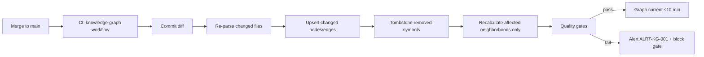

# JourneyLab — Knowledge Graph Indexing and Refresh

| Field | Value |
| --- | --- |
| Owner | Platform (unassigned — `BLK-001`) |
| Status | `READY` — pipeline defined; **code-graph coverage blocked until source exists** |
| Tool | GitNexus (`ADR-005`) |
| Verified state | Indexed 2026-08-05 · **~1,860 nodes, ~2,535 edges** · documentation only |
| Last reviewed | 2026-08-05 |

Navigation: [Change impact protocol](CHANGE_IMPACT_PROTOCOL.md) · [Schema](KNOWLEDGE_GRAPH_SCHEMA.md) · [Quality & governance](GRAPH_QUALITY_AND_GOVERNANCE.md) · [Query playbook](GRAPH_QUERY_PLAYBOOK.md) · [00-START-HERE](../00-START-HERE.md)

---

## 1. Verified installation state

Recorded from direct execution, not assumed:

| Fact | Value |
| --- | --- |
| Installation | `npx gitnexus analyze` executed successfully in this repository |
| Repository | `/Users/deepeshgupta/Projects/journeylab`, registered as `journeylab` |
| Remote | `https://github.com/deepeshgupta12/journeylab.git` |
| Index result | **~1,860 nodes, ~2,535 edges**, 0 clusters, 0 execution flows |
| Status | `npx gitnexus status` → up to date at the indexed commit |
| Artifacts created | `.gitnexus/` (index), `CLAUDE.md` + `AGENTS.md` (context, marker-delimited), `.claude/skills/gitnexus/` (6 skill files), `.gitignore` entry for `.gitnexus` |
| **Runner caveat** | `.gitnexus/run.cjs` was **not** generated; `node .gitnexus/run.cjs` fails with `MODULE_NOT_FOUND`. **Use `npx gitnexus <command>`** (`ASM-009`) |
| **Coverage caveat** | Index covers Markdown documentation only — there is no application source (`RISK-014`) |

---

## 2. Command reference

| Task | Command |
| --- | --- |
| Build or refresh the index | `npx gitnexus analyze` |
| Force a full re-index | `npx gitnexus analyze --force` |
| Enable semantic search embeddings | `npx gitnexus analyze --embeddings` |
| Check freshness | `npx gitnexus status` |
| List indexed repositories | `npx gitnexus list` |
| Delete the index | `npx gitnexus clean` (`--force`, `--all`) |
| Generate wiki documentation | `npx gitnexus wiki` |

**Embeddings are off by default** and must remain off until [GRAPH_QUALITY_AND_GOVERNANCE](GRAPH_QUALITY_AND_GOVERNANCE.md) §4 confirms that no secret, customer payload or restricted content can enter them (`REQ-KG-007`).

---

## 3. Repository inventory and exclusions

| Included | Excluded | Reason |
| --- | --- | --- |
| `apps/`, `services/`, `packages/`, `db/`, `ml/`, `knowledge/`, `contracts/`, `infra/`, `deploy/`, `tests/`, `docs/` | `node_modules/`, `.venv/`, build output | Third-party code is not first-party coverage |
| First-party source, contracts, migrations, IaC, CI, tests | `packages/contracts/src/generated/` | Generated clients are derived; indexing them inflates coverage and creates phantom dependencies |
| Documentation | `.gitnexus/` | The index itself |
| — | Fixtures containing sanitized payloads | Kept out of embeddings; indexed as files only |

**Exclusions must be explicit and visible** in the coverage report (`REQ-KG-001`). A silently skipped directory is indistinguishable from a directory with no dependencies — and that difference matters.

---

## 4. Extraction pipeline

| Stage | Input | Output |
| --- | --- | --- |
| 1. Inventory | Repository tree, exclusion rules | File list with owner and sensitivity metadata |
| 2. Language-aware parsing | Source files (Tree-sitter) | Symbols, imports, definitions, references, call candidates |
| 3. Symbol resolution | Language-server assistance | Resolved calls; unresolved calls **recorded as gaps, not dropped** |
| 4. Contract parsing | OpenAPI, AsyncAPI, JSON Schema, GraphQL, protobuf | `APIEndpoint`, `Schema`, `Event`, `Topic` nodes |
| 5. Data parsing | Migrations, ORM metadata | `Table`, `Column`, `Index`, `Migration` nodes |
| 6. Infrastructure parsing | IaC, CI workflows, deployment manifests | `Service`, `Deployment`, `Environment`, `InfrastructureResource` |
| 7. AI/ML parsing | Model registry, prompt registry, evaluation datasets | `Model`, `Feature`, `Prompt`, `Retriever`, `Tool`, `Guardrail`, `EvaluationDataset` |
| 8. Test parsing | Test files and fixtures | `TestCase` nodes and `TESTED_BY` edges |
| 9. Requirement linking | `docs/product/` requirement IDs | `Requirement`, `ScopeStep` nodes and `IMPLEMENTS_REQUIREMENT` edges |
| 10. Git provenance | Commit history | Introducing commit, last material change, author, reviewer, release |
| 11. Runtime join | OTel route templates, SQL fingerprints, topic names, model traces | `OBSERVED_BY` edges — **without storing customer payloads** |
| 12. Load | All of the above | Upsert with uniqueness constraints, temporal validity, confidence |
| 13. Quality checks | Loaded graph | Orphan APIs, unowned modules, untested requirements, unresolved calls, stale clients |

**Joining rule:** exact identifiers first, reviewed semantic matches second. A semantic match is always an **inferred edge** carrying provenance and confidence (`REQ-KG-005`).

---

## 5. Incremental refresh

**Reading the diagram.** Only affected neighborhoods are recalculated, which is what makes a ten-minute refresh target achievable on a large repository. Removed symbols are **tombstoned rather than deleted** so that history, and any dangling reference to them, remains inspectable.

| Trigger | Action |
| --- | --- |
| Every merge to `main` | Incremental refresh, target ≤ 10 min (`REQ-KG-003`) |
| **Every sub-step commit** | `npx gitnexus analyze` locally before the next sub-step begins |
| Release cut | Full index + **immutable tagged release graph** (`REQ-KG-004`) |
| Extractor version change | Full re-index (`--force`) |
| Suspected corruption | `npx gitnexus clean` then `analyze --force` |

---

## 6. Deletion propagation

When a data-subject deletion runs, graph content derived from that subject must be removed and proven removed (`REQ-PRIV-006`).

| Graph content | Deletion behavior |
| --- | --- |
| **Code graph** | Contains no customer data by construction — nothing to delete |
| **Domain graph** | Tenant-scoped nodes and edges deleted with the trip/subject |
| Embeddings | Vector chunks deleted alongside their source records |
| Release graphs | Immutable; must therefore **never contain personal data** — this is why the domain graph is excluded from release snapshots |

The immutability of release graphs and the deletability of personal data are only compatible because the two graphs are kept separate. That separation is a privacy control, not an organisational preference.

---

## 7. Backup, restore and disaster recovery

| Aspect | Approach |
| --- | --- |
| Code graph | **Fully reconstructible from source** — backup is an optimisation, not a dependency. Recovery = `analyze --force` |
| Domain graph | Reconstructible from the transactional database and event log; backed up with the primary data tier |
| Release graphs | Backed up and immutable — these are audit artifacts and cannot be regenerated identically after refactoring |
| RTO | Code graph: one full index run. Domain graph: per the primary data tier RTO |
| Verification | Restore rehearsed quarterly with the other DR exercises |

---

## 8. Monitoring

| Metric | Alert |
| --- | --- |
| Refresh lag after merge | `ALRT-KG-001` if > 10 min |
| Coverage % of first-party files | Alert below 95% (`REQ-KG-001`) |
| Public symbols with an owner | Alert below 90% (`REQ-KG-002`) |
| Unresolved call count | Trend alert on increase |
| Extraction failures | Alert on any new failing file |
| Index/HEAD divergence | Alert if the graph is behind at a release gate |

Runbook: `RB-KG-001`.

---

## 9. Current gates status

| Gate | Target | Actual | Status |
| --- | --- | --- | --- |
| First-party files parsed | ≥ 95% | Documentation only; **no source files exist** | **Not evaluable** |
| Public symbols owned | ≥ 90% | No symbols exist | **Not evaluable** |
| Refresh ≤ 10 min after merge | Required | No CI exists | **Not implemented** |
| Release graph immutable/tagged | Required | No release | **Not implemented** |
| Edge precision threshold | Agreed threshold | No inferred edges | **Not evaluable** |
| No unowned API/event/migration/model/service | Required | None exist | **Not evaluable** |
| Extraction gaps visible | Required | Coverage report available via `status` | **Partially met** |

**Required next action:** re-run `npx gitnexus analyze` immediately after the first source-code merge, then evaluate every gate above for the first time.
</content>
