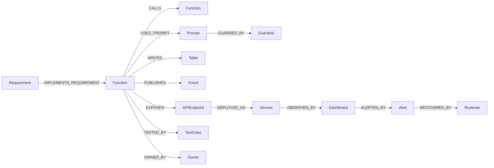

# JourneyLab — Knowledge Graph Schema

| Field | Value |
| --- | --- |
| Owner | Platform + Data Architect (unassigned — `BLK-001`) |
| Status | `READY` — schema specified; code graph populated by GitNexus, domain graph built in `STEP-026` |
| Last reviewed | 2026-08-05 |

Navigation: [Domain graph](DOMAIN_KNOWLEDGE_GRAPH.md) · [Code graph](CODEBASE_KNOWLEDGE_GRAPH.md) · [Indexing](INDEXING_AND_REFRESH.md) · [Quality](GRAPH_QUALITY_AND_GOVERNANCE.md) · [00-START-HERE](../00-START-HERE.md)

---

## 1. Two graphs, one discipline

| | Domain graph | Code graph |
| --- | --- | --- |
| Explains | Product decisions, evidence, dependencies, lifecycle | Implementation, data/model lineage, runtime impact |
| Scoped by | **Tenant** | **Repository permissions** |
| Contains personal data | Yes (tenant-scoped) | **No — by construction** |
| Source of truth | No — derived from PostgreSQL | No — derived from source control |
| Built by | `STEP-026` (`services/knowledge/`) | GitNexus (`ADR-005`) |
| Deletable | Yes, with the subject | N/A |
| Snapshotted immutably at release | **No** (would conflict with deletion) | **Yes** (`REQ-KG-004`) |

They are connected — a requirement links to the code implementing it and to the product decisions justifying it — but **permission-separated**. A caller authorized for one is not thereby authorized for the other.

---

## 2. Universal node properties

Every node in either graph carries:

| Property | Purpose |
| --- | --- |
| `id` | Deterministic, stable across re-index — enables upsert rather than duplicate |
| `source_location` | File path + span, or table + row reference |
| `commit` | Commit at which this state was observed |
| `extractor_version` | Which extractor produced it — makes regressions attributable |
| `confidence` | 1.0 for exact extraction; < 1.0 for inferred |
| `observed_at` / `effective_from` / `effective_to` | Temporal validity where relevant |
| `permission_scope` | Tenant ID or repository/path scope |
| `tombstoned` | Soft-delete marker preserving history |

Every **inferred** edge additionally carries `inference_method` and `evidence`, and is correctable by a human — corrections become extractor regression tests (`REQ-KG-005`).

---

## 3. Code graph node classes

| Class | Nodes |
| --- | --- |
| Version control | `Repository`, `Branch`, `Commit`, `PullRequest`, `Owner` |
| Code symbols | `File`, `Package`, `Module`, `Class`, `Function`, `Method`, `Type`, `Constant` |
| Contracts & async | `APIEndpoint`, `Schema`, `Event`, `Topic`, `Workflow`, `Job` |
| Data | `Table`, `Column`, `Index`, `Migration`, `Dataset`, `DataContract` |
| ML | `Model`, `Feature`, `TrainingRun`, `EvaluationDataset`, `Metric` |
| AI | `Prompt`, `Retriever`, `Tool`, `Guardrail` |
| Product linkage | `Requirement`, `ScopeStep`, `TestCase` |
| Runtime | `Service`, `Container`, `Deployment`, `Environment`, `InfrastructureResource` |
| Operations | `Dashboard`, `Alert`, `Runbook`, `Incident` |

Code symbol nodes additionally carry `language`, `path`, `span`, `hash` and `visibility`.

## 4. Code graph edges

| Category | Edges |
| --- | --- |
| Structure | `CONTAINS`, `IMPORTS`, `CALLS`, `IMPLEMENTS`, `REFERENCES` |
| Contracts | `EXPOSES`, `PUBLISHES`, `CONSUMES` |
| Data | `READS`, `WRITES`, `MIGRATES` |
| ML | `TRAINS_ON`, `PRODUCES_FEATURE`, `SERVES_MODEL` |
| AI | `USES_PROMPT`, `RETRIEVES_FROM`, `INVOKES_TOOL`, `GUARDED_BY` |
| Product | `REQUIRED_BY`, `IMPLEMENTS_REQUIREMENT`, `TESTED_BY` |
| Delivery | `DEPLOYED_AS`, `DEPENDS_ON`, `OWNED_BY`, `CHANGED_IN` |
| Operations | `OBSERVED_BY`, `ALERTED_BY`, `DOCUMENTED_BY`, `RECOVERED_BY` |

**Reading the diagram.** This is the chain that answers the question the protocol actually needs: from a requirement, through the code implementing it, to the contract it exposes, the data it touches, the tests covering it, and the alert and runbook that catch it in production. A break anywhere in that chain is a governance gap the quality checks surface.

---

## 5. Domain graph schema

### Node types
| Group | Nodes |
| --- | --- |
| People and intent | `Traveler`, `Preference`, `Constraint` — each with explicit source and sensitivity |
| Trip structure | `Trip`, `TripBrief`, `Scenario`, `ScenarioVersion` |
| Geography | `Place`, `Activity`, `Accommodation`, `TransitStop`, `RouteSegment` |
| Evidence | `EvidenceFact`, `SourceDocument`, `Provider`, `FreshnessPolicy` |
| Outcomes | `ItineraryItem`, `BookingReference`, `ImpactEvent`, `Feedback` |

### Edge types
| Group | Edges |
| --- | --- |
| Intent | `HAS_CONSTRAINT`, `PREFERS`, `EXCLUDES`, `PARTICIPATES_IN` |
| Structure | `SCENARIO_FOR`, `VERSION_OF`, `CONTAINS_ITEM`, `PRECEDES` |
| Geography | `LOCATED_AT`, `CONNECTED_BY`, `REQUIRES_TRANSFER`, `ACCESSIBLE_BY` |
| Evidence | `SUPPORTED_BY`, `CONTRADICTS`, `OBSERVED_BY`, `VALID_DURING` |
| Change | `AFFECTS`, `REPLACES`, `PRESERVES`, `SELECTED_OVER` |

**`CONTRADICTS` and `SELECTED_OVER` are the two edges that make the product explainable.** `CONTRADICTS` preserves source disagreement instead of averaging it away; `SELECTED_OVER` records why one option beat another, which is what answers "why this activity and not that one".

### Temporal and sensitivity rules
- `VALID_DURING` carries the effective window; `OBSERVED_BY` carries observation time. A query for trip dates filters on **effective** time, not observation time.
- `Constraint` and `Preference` nodes carry a sensitivity label; accessibility constraints are sensitive and are never exposed to collaborators verbatim (`REQ-COLL-002`).
- Every domain node carries `tenant_id`; traversal is filtered before results are assembled, never after.

---

## 6. Cross-graph linkage

The two graphs meet at exactly three node types, and only these:

| Shared node | Purpose |
| --- | --- |
| `Requirement` | Links product intent to implementing code and tests |
| `ScopeStep` | Links delivery units to code and contracts |
| `DataContract` | Links a canonical dataset definition to both its producing code and its domain semantics |

Traversal across the boundary requires authorization for **both** sides. A caller with repository access does not thereby gain access to tenant data, and vice versa (`REQ-KG-006`).

---

## 7. Storage

| Graph | Store | Rationale |
| --- | --- | --- |
| Code graph | GitNexus index (`.gitnexus/`) | Purpose-built; already operational |
| Domain graph | Neo4j **or** PostgreSQL recursive queries — **open** (`DEC` in `STEP-026`) | Polyglot persistence must be justified by real traversal depth, not assumed |
| Embeddings | Graph index or pgvector | Permission-filtered; **no secrets or customer payloads** (`REQ-KG-007`) |
