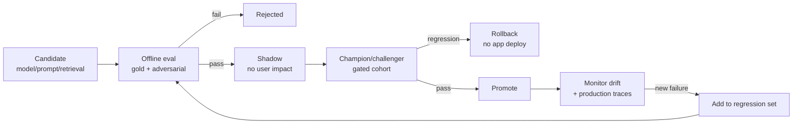

# JourneyLab — AI/ML Evaluation

| Field | Value |
| --- | --- |
| Owner | AI/ML Architect (unassigned — `BLK-001`) |
| Status | `DISCOVERY` — **no datasets, no scorers, no baselines** |
| Upstream source | Blueprint §13 (AI/ML), §16 (evaluation and release gates) |
| Governing rule | `CON-005` — every AI feature ships with gold/adversarial evals, lineage, cost/latency budgets, safe fallback and a named human decision boundary |
| Last reviewed | 2026-08-05 |

Navigation: [AI architecture](../03-architecture/AI_LLM_RAG_ML_ARCHITECTURE.md) · [Test strategy](TEST_STRATEGY.md) · [Release readiness](RELEASE_READINESS_CHECKLIST.md) · [00-START-HERE](../00-START-HERE.md)

---

## 1. Evaluation datasets

| Dataset | Contents | Size target | Refresh |
| --- | --- | --- | --- |
| **Gold — brief extraction** | Human-verified text → typed constraint pairs across locales, currencies, date formats, party compositions, accessibility phrasings | Set at Phase 0 | Per locale added |
| **Gold — retrieval** | Queries with known-correct place/fact sets and effective windows | Per destination pack | Per pack |
| **Gold — citation** | Claims with verified supporting spans | Per destination pack | Per pack |
| **Gold — scenario** | Briefs with verified feasible/infeasible outcomes and known conflict sets | Per destination pack | Per solver change |
| **Adversarial — injection** | Retrieved content containing instructions, tool descriptions with embedded directives | Continuously grown | Per incident |
| **Adversarial — contradiction** | Sources deliberately disagreeing on hours, price, accessibility | Per pack | Per pack |
| **Adversarial — staleness** | Facts past freshness thresholds; effective windows outside trip dates | Per pack | Per pack |
| **Adversarial — ambiguity** | Ambiguous currencies, ages, dates, mobility statements | Per locale | Per locale |
| **Adversarial — sparse evidence** | Deliberately thin coverage to test abstention | Per pack | Per pack |
| **Regression from production** | Traces converted into test cases via the MLflow quality loop | Continuous | Per incident |

**Production traces become regression cases.** A failure observed once must be reproducible forever — that is what stops the same class of error recurring.

---

## 2. Metrics per capability

### AI-001 — Brief extraction
| Metric | Gate |
| --- | --- |
| Field-level precision / recall per constraint class | Threshold from Phase 0 baseline (`DEC-005`) |
| Unit and date accuracy | Near-exact; a misparsed currency or date is a wrong plan |
| **Hard/soft misclassification rate** | Near-zero — misclassifying a hard constraint as soft produces an infeasible plan presented as valid |
| Blocking-ambiguity detection | High recall; missing a blocking ambiguity is worse than over-asking |
| Schema violation rate | 0 reaching downstream (fail closed) |

### AI-002 / AI-004 — Retrieval and abstention
| Metric | Gate |
| --- | --- |
| Place/entity recall | Meets the destination evaluation set |
| Temporal filter correctness | **100%** — an effective-window error silently produces wrong hours |
| Permission filter correctness | **100%** — a leak is `RISK-010` |
| Contradiction detection recall | Baseline from the adversarial set |
| **Abstention precision/recall** | Abstains on genuinely sparse evidence; does not over-abstain on adequate evidence |
| Injection detection rate | Measured on the adversarial corpus; misses are S1 |

### AI-003 — Explanation
| Metric | Gate |
| --- | --- |
| **Citation correctness** | **≥ 95%** — release gate |
| Groundedness | No unsupported factual claim survives to display |
| Trade-off completeness | Material differences all mentioned |
| Calibrated uncertainty | Stated confidence matches observed accuracy |
| Prohibited claims (visa/health/legal/safety) | **0 occurrences** |
| Score fidelity | Explanation never contradicts the computed score |

### AI-006 / AI-007 / AI-008 — Solver, simulation, diversity
| Metric | Gate |
| --- | --- |
| Hard-constraint violations | **0** across the corpus |
| Conflict-set minimality | Verified minimal on known-infeasible cases |
| Reproducibility | Identical inputs + seed ⇒ identical output |
| Optimality gap | Within agreed bounds |
| Simulation calibration | Predicted intervals match observed outcome frequencies |
| Scenario diversity | Material difference above the threshold (`RISK-002`) |

### AI-009 — Preference learning *(Phase 3)*
| Metric | Gate |
| --- | --- |
| Ranking acceptance lift vs. deterministic baseline | Must beat the baseline to ship |
| Calibration | Monitored |
| **Subgroup performance** | Across party composition and accessibility-constraint groups |
| Reset correctness | Preference reset fully restores prior behavior |
| Leakage checks | Point-in-time features only |

---

## 3. Human review

| Review | When | Reviewer |
| --- | --- | --- |
| Citation sampling | Every release | Curator + AI/ML |
| Explanation quality | Every prompt change | Product + Design |
| Abstention appropriateness | Monthly | AI/ML |
| Adversarial triage | Per incident | Security + AI/ML |
| Subgroup fairness | Per model promotion | AI/ML + Product |

**Automated metrics gate; humans review what the metrics cannot see** — notably whether an explanation is *misleading while technically grounded*.

---

## 4. Cost and latency budgets

| Capability | Latency budget | Cost budget | Breach behavior |
| --- | --- | --- | --- |
| AI-001 brief extraction | Interactive | Per request | Degrade to structured form |
| AI-002 retrieval | Within pack-build budget | Per pack | Cached/marked-stale pack |
| AI-003 explanation | Non-blocking | Per scenario set | Templated deltas |
| AI-009 ranking | Sub-second | Negligible | Deterministic ordering |

Budgets are enforced at the gateway, measured per request, and aggregated into `KPI-007`. **Exceeding a budget degrades the capability; it never delays the user indefinitely.**

---

## 5. Promotion and rollback

**Reading the diagram.** Model rollback is independent of application deployment (`REQ-PLAT-012`) — a model regression must be reversible in minutes without shipping code. The loop from production failure back into the regression set is what makes the evaluation corpus grow toward reality instead of staying synthetic.

| Gate | Requirement |
| --- | --- |
| Offline | No regression beyond agreed tolerance on golden packs, edge cases, accessibility and cost/latency budgets |
| Shadow | Behavior compared against champion on live traffic without user impact |
| Promotion | Champion/challenger result plus named approver |
| Rollback | Proven, exercised, independent of application deploy |
| **Non-AI fallback** | Proven working at every promotion (`REQ-AI-007`) |

---

## 6. Lineage

Every AI result records prompt version, model version, retrieval configuration, source pack ID, tool results, cost and latency in a single trace with sensitive fields redacted (`REQ-AI-006`). Model artifacts are content-addressed. Without this, an evaluation result cannot be attributed to a cause.

---

## 7. Status

| Artifact | Status |
| --- | --- |
| Gold datasets | **None** — blocked by `DEC-002` (no region ⇒ no destination pack) |
| Adversarial datasets | None |
| Scorers (`mlflow/scorers/`) | Do not exist |
| Baselines | Not measured |
| Thresholds | Only two are fixed by the blueprint: **0 hard-constraint violations** and **≥95% citation correctness**. All others await Phase 0/1 baselines (`DEC-005`) |
