# JourneyLab — Backup, Restore and Disaster Recovery

| Field | Value |
| --- | --- |
| Owner | SRE (unassigned — `BLK-001`) |
| Status | `DISCOVERY` — **no infrastructure, no backups, no rehearsal** |
| Blocking decision | `DEC-007` — cloud provider, region and residency undecided |
| Last reviewed | 2026-08-05 |

Navigation: [Deployment](../03-architecture/DEPLOYMENT_ARCHITECTURE.md) · [Operations](OPERATIONS_AND_SUPPORT.md) · [Runbooks](RUNBOOK_INDEX.md) · [Retention](DATA_RETENTION_AND_DELETION.md) · [00-START-HERE](../00-START-HERE.md)

---

## 1. Recovery objectives

**Proposed, not yet approved** — RTO/RPO must be set by the business, since they trade cost against tolerance for loss.

| Tier | Data | Proposed RPO | Proposed RTO | Rationale |
| --- | --- | --- | --- | --- |
| **Tier 1** | PostgreSQL — trips, briefs, scenarios, bookings, consent | ≤ 5 min (PITR) | ≤ 1 h | A lost trip is a lost customer relationship; consent loss is a compliance problem |
| **Tier 2** | Object storage — packs, exports, artifacts | ≤ 1 h | ≤ 4 h | Large but partly regenerable |
| **Tier 3** | Domain graph | ≤ 1 h | ≤ 4 h | **Reconstructible** from PostgreSQL + event log |
| **Tier 4** | Cache | None | Immediate | Never the only copy of business state |
| **Tier 5** | Code graph | None | One index run | **Fully reconstructible** — `npx gitnexus analyze --force` |
| **Tier 6** | Release graphs | ≤ 24 h | ≤ 24 h | Audit artifacts; **cannot be regenerated identically** after refactoring |

**Note on Tier 5 vs. Tier 6:** the working code graph needs no backup because it is derived from source. Release graphs do, because they are point-in-time audit evidence that a later re-index would not reproduce.

---

## 2. Backup strategy

| Store | Method | Frequency | Retention | Encryption |
| --- | --- | --- | --- | --- |
| PostgreSQL | Continuous WAL archiving + PITR; daily full | Continuous / daily | Per retention policy | At rest + in transit |
| Object storage | Versioning + cross-zone replication | Continuous | Per lifecycle policy | At rest |
| Domain graph | Snapshot | Daily | 30 days | At rest |
| Release graphs | Snapshot at release, immutable | Per release | Long | At rest |
| Configuration/IaC | Git | Per commit | Indefinite | — |
| Secrets | Managed secret store with its own backup | Per change | Per policy | Managed keys |

**Backups inherit retention and residency obligations.** A backup that outlives its data's retention period is a deletion failure — deletion must reach backups within a documented window, and that window must be shorter than the retention period.

---

## 3. Restore procedures

| Scenario | Procedure | Verification |
| --- | --- | --- |
| Single-table corruption | PITR restore to a staging instance; targeted repair | Row counts + referential integrity |
| Full database loss | PITR to a new instance; reattach services | End-to-end trip trace works |
| Object storage loss | Restore from replication/versioning | Evidence packs referenced by live scenarios resolve |
| Domain graph loss | **Rebuild** from PostgreSQL + event log | Sample queries `KG-Q-001`/`KG-Q-002` return correct results |
| Code graph loss | `npx gitnexus clean && npx gitnexus analyze --force` | `status` reports current at `HEAD`; **pre-change checks are `BLOCKED` until this completes** |
| Region loss | Restore into a secondary region per `DEC-007` | Full smoke suite |
| Accidental deletion | PITR **before** the deletion; re-apply legitimate deletions afterwards | Deletion proof re-run |

**The last row is the subtle one:** restoring from a backup taken before a legitimate data-subject deletion re-creates data that must not exist. Any restore that crosses a deletion event must re-apply those deletions and record the fact.

---

## 4. Disaster recovery

```mermaid
graph LR
  A["Disaster declared"] --> B["Assess scope<br/>zone · region · store"]
  B --> C["Declare SEV1<br/>assign IC"]
  C --> D["Preserve evidence"]
  D --> E["Restore Tier 1<br/>PostgreSQL PITR"]
  E --> F["Restore Tier 2<br/>object storage"]
  F --> G["Rebuild Tier 3+5<br/>graphs — derived"]
  G --> H["Reattach services<br/>flags default safe"]
  H --> I["Smoke + trip trace"]
  I --> J["Re-apply deletions<br/>crossed by the restore"]
  J --> K["Resume traffic<br/>staged"]
  K --> L["Retrospective"]
```

**Reading the diagram.** Derived stores are rebuilt rather than restored, which shortens recovery — but only if the rebuild path is actually exercised. That is why the quarterly drill rebuilds the graphs instead of restoring them from a snapshot.

**Flags default to safe on recovery:** AI capabilities off, new generations paused, region coverage suspended until data freshness is confirmed. Recovering into a state that serves stale evidence as current would turn an outage into a correctness incident.

---

## 5. Rehearsal

| Exercise | Frequency | Success criterion |
| --- | --- | --- |
| Database PITR restore | **Quarterly** | Restored within RTO, data verified |
| Object storage restore | Quarterly | Referenced packs resolve |
| Graph rebuild | Quarterly | Queries return correct results |
| **Offline-sync conflict drill** *(P3)* | Quarterly | Conflicts surface visibly; nothing silently overwritten |
| Full DR | **Before GA**, then annually | Complete system restored and verified |
| Deletion-after-restore | Every DR exercise | Deletions crossed by the restore are re-applied |

**An unrehearsed backup is a hypothesis.** Rehearsal records are a GA gate.

---

## 6. Status

| Item | Status |
| --- | --- |
| Infrastructure | **Does not exist** |
| Backups | None |
| RTO/RPO | **Proposed, not approved** |
| Rehearsals | Never performed |
| Region strategy | Undecided (`DEC-007`) |
| Multi-region failover | **Explicitly out of Phase 1 scope** — recovery is from backup |
