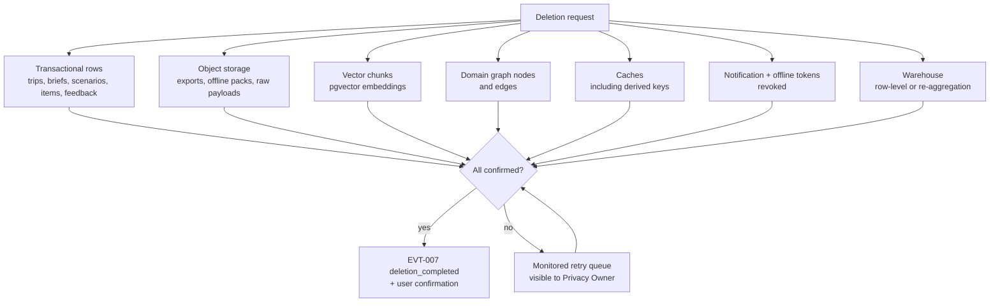

# JourneyLab — Data Retention and Deletion

| Field | Value |
| --- | --- |
| Owner | Privacy Owner + Data Architect (unassigned — `BLK-001`) |
| Status | `DISCOVERY` — policy defined; **no implementation, no legal review** |
| Upstream source | Blueprint §12 (data lifecycle), §14 (privacy) |
| Caveat | **Not legal advice.** Statutory periods and jurisdictions are undetermined (`DEC-007`) |
| Last reviewed | 2026-08-05 |

Navigation: [Data architecture](../03-architecture/DATA_ARCHITECTURE.md) · [Data contracts](../04-contracts/DATA_CONTRACTS.md) · [Security & privacy](../03-architecture/SECURITY_PRIVACY_RESPONSIBLE_AI.md) · [00-START-HERE](../00-START-HERE.md)

---

## 1. Retention schedule

| Data class | Retention | Basis | Deletion trigger |
| --- | --- | --- | --- |
| Raw provider payloads | Minimum for reconciliation and dispute handling | Operational necessity | Scheduled hard delete |
| Canonical evidence facts | Per provider licence terms | Contractual | Licence expiry or provider request |
| Trip and scenario data | User-configurable within policy | Consent | User deletion, retention expiry, account closure |
| Traveler profile (incl. accessibility) | While the account exists | Consent | Account deletion or attribute removal |
| **Precise location** | **Not persisted** — ephemeral processing only | Data minimisation | Nothing to delete by default |
| Booking references and travel documents | **Shorter than trip data**; segregated store | Consent + necessity | Trip deletion or earlier expiry |
| Consent records | As legally required | Legal obligation | **Survives account deletion where law requires** — documented exception |
| Audit events (security/business) | Legally required minimum | Legal obligation | Immutable; documented exception |
| Analytics and evaluation aggregates | Indefinite **only if genuinely non-identifiable** | Legitimate interest | Re-identification risk review |
| Support diagnostic bundles | Short, fixed window | Operational | Automatic expiry |
| Offline packs on device | Trip duration + short grace | Consent | Trip end, revocation, logout |
| Model/prompt traces | Medium; sensitive fields redacted at emission | Quality loop | Scheduled expiry |
| Knowledge graph — domain | With the subject | Derived | Deleted with the trip/subject |
| Knowledge graph — code | N/A — **contains no customer data** | — | — |

**Two documented exceptions to deletion** — consent records and audit events — are the only ones. Both are named, justified and time-bounded rather than treated as a general carve-out.

---

## 2. Deletion traversal

Deletion is only real if it reaches every derived store. This is the traversal proven by `TST-PRIV-006`:

**Reading the diagram.** The fan-out is the point: a deletion that removes the database row but leaves an embedding, a graph node or a cached export has not deleted anything meaningful — it has only made the data harder to find. The retry queue exists because partial failure is normal at this fan-out, and a silent partial failure is a compliance breach.

---

## 3. Data-subject rights

| Right | Implementation | Test |
| --- | --- | --- |
| Access / export | Machine-readable export with confirmation | `TST-PRIV-005` |
| Correction | User-editable profile and constraints; curator path for destination facts | `TST-TRIP-004` |
| Deletion | Full traversal with proof | `TST-PRIV-006` |
| Consent withdrawal | Per purpose, independently, without cascade | `TST-PRIV-002` |
| Restriction | Trip archival without deletion | `TST-TRIP-003` |
| Portability | Structured export in a documented format | `TST-PRIV-005` |
| Objection to inference | **Nothing sensitive is inferred** — declaration only | `TST-PRIV-003` |

Turnaround targets depend on jurisdiction (`DEC-007`, undetermined). The operational commitment is that a request is tracked, confirmed, and its failures visible.

---

## 4. Retention enforcement

| Mechanism | Detail |
| --- | --- |
| Scheduled deletion jobs | Idempotent, resumable, checkpointed |
| Object lifecycle policies | Applied at the bucket level for raw payloads and exports |
| Cache TTLs | Bounded so no cache outlives its source's retention |
| Token revocation | Notification and offline tokens revoked on deletion |
| **Verification** | Automated tests seed data into every store and assert absence after deletion |
| Monitoring | `ALRT-PRIV-001` on retry-queue depth and DSR age |

---

## 5. Special cases

| Case | Handling |
| --- | --- |
| Shared trip, one collaborator deletes | Their contributions are removed or pseudonymised; the owner's trip survives. Deleting a collaborator must not destroy the owner's plan |
| Trip owner deletes with active collaborators | Collaborators notified; the trip is removed for all — ownership governs |
| Evidence pack referenced by a live scenario | Pack is immutable and cannot be deleted while referenced; deletion of the trip releases it |
| Licensed data in an export | Export respects per-source redistribution terms; may legitimately contain less than the UI showed |
| Deletion during an active trip *(P3)* | Warn about losing the offline pack and live monitoring; require explicit confirmation |
| Legal hold | Suspends deletion; **must be recorded, time-boxed and reviewed** — an indefinite hold is a policy failure |

---

## 6. Status

| Item | Status |
| --- | --- |
| Deletion implementation | Does not exist (`STEP-025`) |
| Traversal test | Does not exist |
| Legal review | **Not performed** |
| Jurisdictions | Undetermined (`DEC-007`, `ASM-003`) |
| Statutory retention periods | Unknown — the schedule above states relative durations, not legally validated ones |
</content>
