# JourneyLab — Incident Response

| Field | Value |
| --- | --- |
| Owner | SRE + Security Architect (Deepesh Kumar Gupta) |
| Status | `DISCOVERY` — process defined; **no on-call rotation exists** |
| Requirement | Incident response, breach notification, backup restoration, DR and third-party outage playbooks **before production launch** |
| Last reviewed | 2026-08-05 |

Navigation: [Operations](OPERATIONS_AND_SUPPORT.md) · [Runbooks](RUNBOOK_INDEX.md) · [Bug register](../10-logs/BUG_REGISTER.md) · [Security](../03-architecture/SECURITY_PRIVACY_RESPONSIBLE_AI.md) · [00-START-HERE](../00-START-HERE.md)

---

## 1. Severity

| Sev | Definition | Response | Comms |
| --- | --- | --- | --- |
| **SEV1** | Cross-tenant exposure · data loss · privacy breach · **hard-constraint violations reaching users** · complete outage | Immediate, all hands, release halted | Exec + affected users; regulator if breach |
| **SEV2** | Core journey degraded · citation correctness below gate · provider outage blocking a region · deletion failures accumulating | Same business day | Status page + support brief |
| **SEV3** | Partial degradation with a workaround · elevated errors within budget | Next business day | Internal |
| **SEV4** | Cosmetic, no user impact | Backlog | Internal |

**Two SEV1s are product-quality, not availability:** delivering a plan that violates a hard constraint, and cross-tenant exposure. Both can occur with every uptime metric green. Classifying them as SEV1 is deliberate — this product's core promise is correctness, not merely being up.

---

## 2. Lifecycle

```mermaid
graph LR
  A["Detect<br/>alert · user report · drill"] --> B["Declare + assign IC"]
  B --> C["Assess severity<br/>and blast radius"]
  C --> D["Preserve evidence"]
  D --> E["Mitigate<br/>degrade · flag off · roll back"]
  E --> F["Verify recovery"]
  F --> G["Communicate"]
  G --> H["Retrospective<br/>blameless, ≤5 days"]
  H --> I["Actions into backlog<br/>+ regression tests"]
  I --> J["Runbook updated"]
```

**Reading the diagram.** Evidence preservation sits *before* mitigation. The instinct under pressure is to restart the failing thing, which routinely destroys the only record of what happened. For this product the evidence is specific: the correlation ID, the evidence pack, the solver seed and config, the model/prompt versions, and the provider health at the time — without those, the incident cannot be reproduced afterwards.

---

## 3. Roles

| Role | Responsibility |
| --- | --- |
| **Incident Commander** | Owns the incident; makes the call; is not the person fixing it |
| Operations lead | Executes mitigation |
| Communications lead | Status page, support, stakeholders |
| Scribe | Timeline, decisions, evidence links |
| Subject expert | Pulled in per domain (solver, data, AI, privacy) |
| Privacy Owner | **Required for any personal-data incident** |
| Security Architect | **Required for any suspected breach** |

**The IC does not debug.** Combining command and repair is how incidents lose their timeline and their communications.

---

## 4. Product-specific incident types

| Incident | Sev | First action | Runbook |
| --- | --- | --- | --- |
| Hard-constraint violation in delivered scenarios | **SEV1** | Disable scenario generation via flag; preserve solver inputs, config and seeds | RB-SOLVER-001 |
| Cross-tenant exposure | **SEV1** | Revoke sessions, preserve audit, halt release | RB-SEC-001 |
| Deletion failure affecting a DSR deadline | SEV1/2 | Preserve queue state; notify Privacy Owner | RB-PRIV-001 |
| Stale data presented as current | SEV2 | Force circuit break; mark region degraded | RB-DATA-001 |
| Provider outage blocking a region | SEV2 | Suspend new trips for the region; disclose | RB-PROV-001 |
| Citation correctness drop | SEV2 | Roll back prompt/model; disable explanations if needed | RB-AI-001 |
| Prompt injection observed in production | SEV2 | Preserve the payload; disable the affected source; add to adversarial set | RB-AI-001 |
| Notification storm *(P3)* | SEV2 | Suppress notifications; investigate matching logic | RB-LIVE-001 |
| Affiliate attribution loss | SEV3 | Preserve handoff records; reconcile later | RB-PROV-002 |
| Graph index corruption | SEV3 | `npx gitnexus clean` then `analyze --force`; **pre-change checks are `BLOCKED` until restored** | RB-KG-001 |

---

## 5. Communication

| Audience | When | Content |
| --- | --- | --- |
| Affected users | SEV1/2 with user impact | What is wrong, what to do, when to expect an update. **Never minimise a wrong-plan incident** — users may be travelling on it |
| Status page | SEV1/2 | Current state, updated on a fixed cadence |
| Support | All | Symptoms, workaround, escalation path |
| Executives | SEV1 | Impact, mitigation, ETA |
| Regulator | Confirmed personal-data breach | Within the statutory window; **jurisdictions undetermined (`DEC-007`)** |
| Providers | If caused or affected by them | Factual, contractual |

**Travel-specific duty:** a user acting on a wrong plan may be mid-journey. For any incident that delivered an infeasible or unsafe itinerary, direct notification to affected travellers is required — a status-page entry is not sufficient.

---

## 6. Evidence preservation

Before mitigation, capture: correlation IDs, trip and scenario IDs, evidence pack ID and coverage report, solver config + seed + version, model/prompt/retrieval versions, provider health and quota state, feature-flag state, queue and DLQ state, relevant audit events.

**Preserve under the same privacy rules as production.** An incident is not authorisation to copy personal data into a shared channel.

---

## 7. Retrospective

Blameless, within five working days, for every SEV1 and SEV2. Required output:

- timeline from first symptom to resolution
- root cause, and **why existing tests and alerts did not catch it**
- contributing factors, including process and documentation
- **a regression test for every defect found** (`BUG-NNN`, enforced by check R6)
- runbook updates
- actions with owners and dates in the backlog
- register updates if an assumption or risk was wrong

**A retrospective without a regression test has not finished.**

---

## 8. Status

| Item | Status |
| --- | --- |
| On-call rotation | **Does not exist** |
| Incident tooling and channels | Not configured |
| Status page | Does not exist |
| Breach notification obligations | Undetermined (`DEC-007`) |
| Playbooks | `PROPOSED` — required before production launch |
